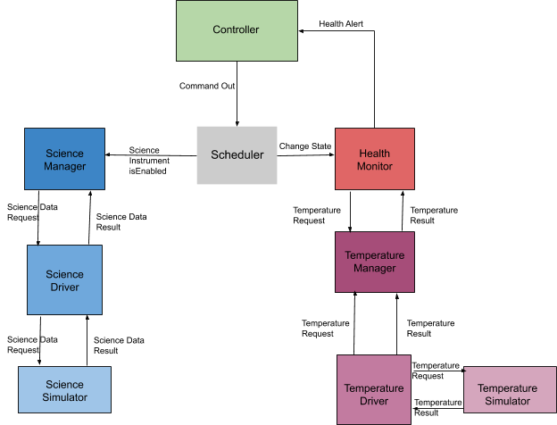

# AEGIS F Prime Demo
This is a demonstration of the F Prime flight software framework for the AEGIS satellite. The latest version of the demo was built on a fork from NASA's version 1.3.1 repository for F Prime. This repository contains a working version of the demo with installation instructions in the following sections. If you wish to recreate this demo from scratch, those instructions can be found immediately after the design explanation in this document. Do note that this readme file has replaced the original that comes with F Prime which contains quick reference information. The original readme can be found at [https://github.com/nasa/fprime/tree/NASA-v1.3.1](https://github.com/nasa/fprime/tree/NASA-v1.3.1).

# Table of Contents
**1. [Installing the Demo](#installing-the-demo) 
2. [Demo Design](#demo-design) 
3. [Using the Demo](#using-the-demo) 
4. [Tutorial](#tutorial)**

# Installing the Demo

## Ubuntu
This demo must be run on an Ubuntu machine with 16.04 LTS being the current suggested version. Newer versions may be compatible, but some individuals have run into incompatibilities between newer versions and the plugins that F Prime requires. A virtual machine is an acceptable and common means of using Ubuntu for this project. Any major virtual machine software (VirtualBox, VMware, etc.) should be suitable for this project and run without issue. Default installations for both VM software and Ubuntu should be used.

## Installing F Prime
The following instructions are a condensed and project specific version of the original install instructions. The original document can is located [here](docs/INSTALL.md).

### Create a Python Environment
The following commands will create a new virtual environment called `aegis-venv` and ensure that the virtual environment is activated.

```
python3 -m venv ./aegis-venv
. ./aegis-venv/bin/activate
```

Any time the user wishes to use F´, this virtual environment should be activated. This should be done in each new shell the user uses. This is all that is required to activate F´ for use. Further information on the motivation behind and usage of python virtual environments can be found at [https://docs.python.org/3/tutorial/venv.html](https://docs.python.org/3/tutorial/venv.html).

### Cloning the F´ Repository

Installation of F´ requires cloning of the F´ core repository. This uses Git. This will bring down the core framework and C++ files. The following commands will create a new directory called `aegis-fprime-demo` which contains all the files in this repository and will also switch to the branch containing the files specific to the demo.

**Clone F´**

```
git clone https://github.com/Aleha-C/fprime aegis-fprime-demo
```

**Checkout the AEGIS project branch**

```
cd aegis-fprime-demo
git checkout AEGIS_Assignment
```

### Installing F´ Python Requirements

F´ python support packages have certain requirements on various Python packages available on PYPI. These requirements are broken out in two files one for the Autocoder tools and one for the GDS tools package. This is to enable users to choose which tools they'd like to use.

**Installing F´ Python Packages**
The following commands should be run from the root of the `aegis-fprime-demo` directory.
```
pip install ./Fw/Python
pip install ./Gds
```

### Run the Demo

```
cd Ref
fprime-util generate
fprime-util build-all
fprime-util install
fprime-gds -d .
```
A browser window should pop up showing the ground system. An explanation of the project and a usage guide will be provided in subsequent sections. This window will be place to enter commands when going through the instructions in the demo usage section.

# Demo Design


This demo simulates a satellite that has one temperature sensor, one science instrument and an internal controller software component that takes in commands from ground control. 

The goal of this demo is to create a system that:

 - Appropriately sets health monitoring flags in response to changing temperature readings
 - Changes the ConOps phase based on ground control input or the need for safety mode entry in response to temperature readings
 - Enables and disables components as needed for each phase

## Key Points

 - This is a satellite with only one temperature sensor and a single science instrument.
 - The thermometer is a critical piece of equipment with no varying operational power levels, so it will not be turned off once the satellite is turned on.
 - There is a temperature threshold (referred to here as the global fatal temperature) that will cause the satellite to go into safety mode regardless of the current phase. There are also, however, individual thresholds for each phase within the bounds of the global fatal temperature that constitute a warning. For example, it would be expected that temperatures would rise dramatically during the warmup and burn phases and would not result in a warning. Those same temperatures during the science phase would constitute a warning. 
 - This demo will produce a warning when the temperature has surpassed the threshold for the current phase, but has not yet surpassed the global fatal temperature. Once that fatal temperature is reached, the satellite will automatically enter safety mode. 
 - Safety mode acts as a stub for any contingency operations that would be executed in response to the fatal temperature warning being thrown.

## Component Breakdown

###  Controller
-   The point of interaction between ground control and the satellite.
    
-   Takes commands from the user and converts them into a format the scheduler can use to easily dispatch commands to the appropriate components. The internal structure used for commands described in later figures.
    
-   Maintains the current ConOps phase.
    
-   Receives warning from the health monitoring component about the satellites temperature and will switch the satellite to safety mode if necessary.
    

###  Scheduler
-   Uses the internal command structure, shown in later figures, to take commands from the controller and dispatch them to the correct components.
    
-   Does not consider system time for scheduling, but instead acts as a command router.
    

###   Science Simulator
- Produces randomly generated numbers that simulate the data associated with an observable physical event in space.
- Continues to produce data even when the science module is disabled as this component simulates the environment outside of the satellite.
    
### Science Driver
-   Creates an abstraction layer that simply requests a data reading from the simulator and passes it on to the manager. 
- Does no operations on the data, but is included to demonstrate the component structure of a system that uses a hardware instrument to collect science data.
    
### Science Manager
-   Requests data from the science simulator via the science driver.
- Takes any commands that are specific to the science instrument from the scheduler. These commands will only be to either enable or disable the science instrument.
    

###  Temperature Manager/Driver/Simulator
-   Works exactly the same as the science equivalent components listed above, except does not use a random number generator to produce data. 
- Takes manually entered data from the user operating the demonstration as described in later sections.
    

###   Health Monitor
-   Maintains a dictionary of temperature thresholds that can be altered during runtime through commands to the controller. 
- Create warnings, based on temperature thresholds, that are sent to the controller. These warnings may also contain an alert to enter safety mode which will be executed by the controller.
- Takes alerts of phase change from the controller (via the scheduler) to determine which temperature thresholds to operate within.

## Internal Information
### Default Phase Data
ConOps Phase | Internal Phase Number | Science Instrument isEnabled | Min. Temperature Threshold | Max Temperature Threshold 
------------------|-----------------|---------------|--------------|----------------
Deployment | 0 | False | 50 | 100
Warmup | 1 | False | 45 | 105
Burn | 2 | False | 55 | 95
Charge | 3 | True | 20 | 200
Comms | 4 | True | 15 | 205
Science | 5 | True | 25 | 195
Pre-Disposal | 6 | True | 10 | 300
Disposal | 7 | True | 15 | 295
Safety Mode (added for demo) | 8 | False | 0 | 100
Global Fatal Temp | 9 (only valid for threshold change) | N/A | 0 | 1000

### Command Structure
Command Type | Time* | Op Code | Val1 | Val2 | Val3** 
------------------|-----------------|---------------|--------------|----------------|-
Update Component Phase | 0 | 0 | Component Number | Phase Number | 0
Update Temperature Threshold | 0 | 1 | Phase | Min | Max
Update Component State | 0 | 2 | Component Number | State (0 or 1) | 0
##### *Time is not considered for this demo and a value of 0 should be used when sending commands to the scheduler’s port from the controller.
##### **Some commands only require two values, value 3 is ignored in this case and typically set to 0.

### Component Data
Component Name | Internal Component Number
---|---
ScienceManager | #100
HealthMonitor | #200
TemperatureManager | #300

# Using the Demo
The user may dispatch commands in whichever order and with any values they see fit. The following instructions take you through a sample run of the demo that shows all of it's functionality and follows the flow of operations to be expected in an actual satellite deployment. All commands are to be entered in the commands tab of the ground system that was opened in a browser window in earlier instructions. Telemetry channels and events can also be seen in the window in their respective tabs.

When using the demo, the user will also be manually setting the satellite's temperature. This is done in place of random temperature generation to allow the user complete control over the simulation to get a better understanding of how the satellite responds. Keep in mind that this interaction is strictly specific to the demo for ease of use and would not be present in an operational satellite.
## Starting Operations
Dispatch the `controller.CONTROLLER_CHANGE_PHASE` command with a value of zero to start the simulation in the deployment phase. After this command runs, you will see several events and telemetry changes. Most are self-explanatory, but the most important points are seen in the telemetry tab. The science manager is disabled as the science instrument will not run during deployment. The science data simulator is generating data but the science manager isn’t collecting it as it is disabled. The health monitor has acknowledged the current phase and will use the appropriate flags.

Next, dispatch the `tempSim.TEMPSIM_SET_TEMP` command with any 32 bit float value. This command forces the temperature simulator to change the satellites temperature to the value specified in the command. This temperature will be retrieved by the temperature manager via the temperature sensor's driver. The demo starts with a temperature of 50, so it may be a good idea to set the temperature higher or lower than that to see the telemetry change accordingly.

This is a good point to enter different phases using the `controller.CONTROLLER_CHANGE_PHASE` command. Phase values can be found in the Default Phase Data table above. Change the temperature, just as described above, to values within the temperature thresholds of each phase to show that the health monitoring component does not create warning events when the temperature is acceptable. The next section will show how the system responds to unacceptable temperatures through warnings and disabling the science component.

## Showing Science and Health Monitor Component Functionality
Dispatch the `controller.CONTROLLER_CHANGE_PHASE` command with a value of 5 to enter the science phase. The science manager will become enabled and collect the science data as the simulator produces it. The health monitor will acknowledge the phase and will use the appropriate temperature thresholds.

Next, dispatch the `tempSIM.TEMPSIM_SET_TEMP` command with a value of 200. This will cause the health monitoring component to create a critical temperature warning in the Events tab. The satellite will continue to operate in phase 5 as this temperature does not constitute a switch to safety mode.

Change the global fatal temperature threshold by dispatching the `controller.CONTROLLER_CHANGE_TEMP_THRESHOLD` with a phase value of 9, min temp of 0 and max temp of 300. As shown in the Default Phase Data table above, the global fatal temperature threshold is targeted by specifying a "phase" value of 9, though this is not an actual operational phase. This simplifies the command dictionary as otherwise, a completely separate command would be necessary to target the global fatal temperature.

To cause the satellite to experience a fatal temperature, dispatch the command `tempSim.TEMPSIM_SET_TEMP` with a value of 400. This will exceed the new global fatal upper threshold and cause the satellite to automatically switch to safety mode. Check the events tab to see the fatal warnings produced by the health monitoring component.

Now, change the temperature back to 100. Though this temperature is back within an acceptable range, the satellite will remain in safety mode. This demo assumes the satellite must get the go ahead from ground control to continue with normal operations after a fatal temperature is reached as ground control may need to assess the satellite through telemetry data before continuing. This is not a strictly necessary feature and is a design choice that is up to the system engineers. To signal that it is safe for the satellite to resume operations, change the phase back to 5 using the same command as used previously.

# Tutorial
This demo is an altered and expanded version of the MathComponent tutorial created by NASA, found [here]([https://github.com/nasa/fprime/tree/NASA-v1.3.1/docs/Tutorials/MathComponent](https://github.com/nasa/fprime/tree/NASA-v1.3.1/docs/Tutorials/MathComponent)). It may be useful to some to complete the MathComponent tutorial first before continuing with this tutorial to get a better understanding of the basics of creating an F Prime deployment. Additionally, make sure to read and understand the design description and internal information as given above before continuing with this tutorial.

The following instructions will walk all the way through implementing the demo and will only instruct you to run the demo at the very end. Though many errors may be found during development when building files, it is very common that people run into issues in the middle of development that may not be exposed until the very last steps when building all the source files together. Adding one component to the system at a time from start to finish is the best way to isolate issues and find them as soon as possible. This means writing one component's description, generating the implementation files and filling them in, and adding the component to the topology files. After that is done for a single component, the software can then be run, the component can be tested and the next component can be added using the same process. Though potentially more time consuming, the developer can be assured that the most recently added component is most likely the source of the issue, making locating the source of an error a quicker process. While some errors are generated by by the F Prime build and deployment systems, the errors do not usually pinpoint the exact source of the issue and require the developer to do some digging and research to resolve them.

If you wish to do the iterative development as described above, note that it is not likely the ports will be the source of errors and any errors with them should be found soon after implementation. Adding all ports first, then starting iterative development with the first component, the temperature simulator in this case, is a good idea. Additionally, it will be necessary to add a test command to each component that does not normally have commands in order to test its functionality when it's added iteratively. Otherwise, there would be no way for the developer to interact with the component to test that it is working properly before continuing development. Adding a test command will be mentioned in the TempDriver section, and the same process can be followed for any other component that does not have commands listed.

## Component Descriptions
This section will cover the components that will be built in this tutorial. Each component may define the commands, events, telemetry channels, and parameters. This section will list commands, events, telemetry channels, and parameters for each component that will be created.

### TemperaturePorts
Looking at the system diagram, there should be four different ports that connect the temperature manager, driver and simulator to each other. These consist of a port for the driver to request the temperature from the simulator and a port for the simulator to send the temperature back, as well as request and result ports between the temperature manager and driver.

If you haven't already, change directories to the Ref directory using the following command
```
cd aegis-fprime-demo/Ref
```

Create the directory that will store the temperature port files:
```
mkdir TemperaturePorts
```

The following sections will describe the file structure for each temperature port.
#### TempDriverReqPortAi.xml
In the TemperaturePorts directory, create a file called `TempDriverReqPortAi.xml`. This will be the port the temperature driver uses to request the temperature from the temperature simulator. The XML for this port is as follows:

```xml
<interface name="TempDriverReq" namespace="Ref">
	<args>
		<arg name="request" type="F32">
		</arg>
	</args>
</interface>
```
This creates a port called TempDriverReq that is expected to appear in the Ref directory. This port has one argument named request which is a 32-bit float value. The "request" argument is included as the port needs an argument, but the data sent will not be processed by the receiver and only serves to invoke the port.
#### TempSimOutPortAi.xml
In the TemperaturePorts directory, create a file called `TempSimOutPortAi.xml`. This will be the port the temperature simulator uses to send the current temperature to the driver as requested. The XML for this port is as follows:

```xml
<interface name="TempSimOut" namespace="Ref">
	<args>
		<arg name="temperature" type="F32">
		</arg>
	</args>
</interface>
```
This creates a port called TempSimOut that is expected to appear in the Ref directory. This port has one argument named temperature which is a 32-bit float value. The "temperature" argument will be used to send the temperature through the port to the driver.
#### TempManagerReqPortAi.xml
In the TemperaturePorts directory, create a file called `TempManagerReqPortAi.xml`. This will be the port the temperature manager uses to request the temperature from the temperature driver. The XML for this port is as follows:

```xml
<interface name="TempManagerReq" namespace="Ref">
	<args>
		<arg name="request" type="F32">
		</arg>
	</args>
</interface>
```
This creates a port called TempManagerReq that is expected to appear in the Ref directory. This port has one argument named request which is a 32-bit float value. The "request" argument is included as the port needs an argument, but the data sent will not be processed by the receiver and only serves to invoke the port.
#### TempDriverOutPortAi.xml
In the TemperaturePorts directory, create a file called `TempDriverOutPortAi.xml`. This will be the port the temperature driver uses to send the current temperature to the manager as requested. The XML for this port is as follows:

```xml
<interface name="TempDriverOut" namespace="Ref">
	<args>
		<arg name="temperature" type="F32">
		</arg>
	</args>
</interface>
```
This creates a port called TempDriverOut that is expected to appear in the Ref directory. This port has one argument named temperature which is a 32-bit float value. The "temperature" argument will be used to send the temperature through the port to the manager.
#### CMakeLists.txt
In the TemperaturePorts directory, create a file named `CMakeLists.txt`. A version of this file will exist in every directory you add to the Ref directory and tells the build system to add in the files you have just created when building the project. The file should look as follows:

```
set(SOURCE_FILES
	"${CMAKE_CURRENT_LIST_DIR}/TempDriverReqPortAi.xml"
	"${CMAKE_CURRENT_LIST_DIR}/TempSimOutPortAi.xml"
	"${CMAKE_CURRENT_LIST_DIR}/TempManagerReqPortAi.xml"
	"${CMAKE_CURRENT_LIST_DIR}/TempDriverOutPortAi.xml"
)
register_fprime_module()
```
#### Ref/CMakeLists.txt
Now that you have added the new files to the directory level build file, the directory you created must be added to the Ref level build file. Open the `Ref/CMakeLists.txt` file, and it should have native directories listed already. Append the new directory to the end of this list:

```
...
add_fprime_subdirectory("${CMAKE_CURRENT_LIST_DIR}/PingReceiver/")
add_fprime_subdirectory("${CMAKE_CURRENT_LIST_DIR}/RecvBuffApp/")
add_fprime_subdirectory("${CMAKE_CURRENT_LIST_DIR}/SendBuffApp/")
add_fprime_subdirectory("${CMAKE_CURRENT_LIST_DIR}/SignalGen/")
add_fprime_subdirectory("${CMAKE_CURRENT_LIST_DIR}/TemperaturePorts/")
```
#### Build the Port
From the Ref directory, run the following command to generate a new build.
```
fprime-util generate
```

Next, change to the TemperaturePorts directory and generate and compile the port code:
```
cd TemperaturePorts
fprime-util build
```
If the XML is formatted properly, this should execute without error and add the port code to the build.

### SciencePorts
Looking at the system diagram, there should be four different ports that connect the science manager, driver and simulator to each other. These consist of a port for the driver to request the science data from the simulator and a port for the simulator to send the data back, as well as request and result ports between the science manager and driver.

From the Ref directory, create the directory that will store the science port files:
```
mkdir SciencePorts
```

The following sections will describe the file structure for each science port.
#### ScienceDriverReqPortAi.xml
In the SciencePorts directory, create a file called `ScienceDriverReqPortAi.xml`. This will be the port the science driver uses to request the science data from the science simulator. The XML for this port is as follows:

```xml
<interface name="ScienceDriverReq" namespace="Ref">
	<args>
		<arg name="request" type="F32">
		</arg>
	</args>
</interface>
```
This creates a port called ScienceDriverReq that is expected to appear in the Ref directory. This port has one argument named request which is a 32-bit float value. The "request" argument is included as the port needs an argument, but the data sent will not be processed by the receiver and only serves to invoke the port.
#### ScienceSimResPortAi.xml
In the SciencePorts directory, create a file called `ScienceSimResPortAi.xml`. This will be the port the science simulator uses to send the science data to the driver as requested. The XML for this port is as follows:

```xml
<interface name="ScienceSimRes" namespace="Ref">
	<args>
		<arg name="science" type="F32">
		</arg>
	</args>
</interface>
```
This creates a port called ScienceSimRes that is expected to appear in the Ref directory. This port has one argument named science which is a 32-bit float value. The "science" argument will be used to send the science data through the port to the driver.
#### ScienceManagerReqPortAi.xml
In the SciencePorts directory, create a file called `ScienceManagerReqPortAi.xml`. This will be the port the science manager uses to request the science data from the science driver. The XML for this port is as follows:

```xml
<interface name="ScienceManagerReq" namespace="Ref">
	<args>
		<arg name="request" type="F32">
		</arg>
	</args>
</interface>
```
This creates a port called ScienceManagerReq that is expected to appear in the Ref directory. This port has one argument named request which is a 32-bit float value. The "request" argument is included as the port needs an argument, but the data sent will not be processed by the receiver and only serves to invoke the port.
#### ScienceDriverResPortAi.xml
In the SciencePorts directory, create a file called `ScienceDriverResPortAi.xml`. This will be the port the science driver uses to send the science data to the manager as requested. The XML for this port is as follows:

```xml
<interface name="ScienceDriverRes" namespace="Ref">
	<args>
		<arg name="science" type="F32">
		</arg>
	</args>
</interface>
```
This creates a port called ScienceDriverRes that is expected to appear in the Ref directory. This port has one argument named science which is a 32-bit float value. The "science" argument will be used to send the science data through the port to the manager.
#### CMakeLists.txt
In the SciencePorts directory, create a file named `CMakeLists.txt`. A version of this file will exist in every directory you add to the Ref directory and tells the build system to add in the files you have just created when building the project. The file should look as follows:

```
set(SOURCE_FILES
	"${CMAKE_CURRENT_LIST_DIR}/ScienceDriverReqPortAi.xml"
	"${CMAKE_CURRENT_LIST_DIR}/ScienceManagerReqPortAi.xml"
	"${CMAKE_CURRENT_LIST_DIR}/ScienceDriverResPortAi.xml"
	"${CMAKE_CURRENT_LIST_DIR}/ScienceSimResPortAi.xml"
)
register_fprime_module()
```
#### Ref/CMakeLists.txt
Now that you have added the new files to the directory level build file, the directory you created must be added to the Ref level build file. Open the `Ref/CMakeLists.txt` file, and it should have native directories listed already as well as any other directories you have added. Append the new directory to the end of this list:

```
...
add_fprime_subdirectory("${CMAKE_CURRENT_LIST_DIR}/PingReceiver/")
add_fprime_subdirectory("${CMAKE_CURRENT_LIST_DIR}/RecvBuffApp/")
add_fprime_subdirectory("${CMAKE_CURRENT_LIST_DIR}/SendBuffApp/")
add_fprime_subdirectory("${CMAKE_CURRENT_LIST_DIR}/SignalGen/")
add_fprime_subdirectory("${CMAKE_CURRENT_LIST_DIR}/TemperaturePorts/")
add_fprime_subdirectory("${CMAKE_CURRENT_LIST_DIR}/SciencePorts/")
```
#### Build the Port
From the SciencePorts directory, generate and compile the port code:
```
cd SciencePorts
fprime-util build
```
If the XML is formatted properly, this should execute without error and add the port code to the build.

### HealthMonitorPorts
From the system diagram, we can see that there are 2 ports connecting the health monitor to the temperature manager and one port connecting the health monitor to the controller. These 3 ports will go in a directory named `HealthMonitorPorts` that you create from the Ref directory just as you have in previous sections. The port connecting the health monitor to the scheduler will be created in a subsequent section.
#### HealthTempReqPortAi.xml
In the HealthMonitorPorts directory, create a file named `HealthTempReqPortAi.xml`. This will be the port the health monitor uses to request a temperature update from the temperature monitor. The XML for the port is as follows:

```xml
<interface name="HealthTempReq" namespace="Ref">
	<args>
		<arg name="request" type="F32">
		</arg>
	</args>
</interface>
```
This creates a port called HealthTempReq that is expected to appear in the Ref directory. This port has one argument named request which is a 32-bit float value. The "request" argument is included as the port needs an argument, but the data sent will not be processed by the receiver and only serves to invoke the port.
#### HealthTempCheckPortAi.xml
In the HealthMonitorPorts directory, create a file called `HealthTempCheckPortAi.xml`. This will be the port the temperature monitor uses to send the temperature update to the health monitor as requested. The XML for this port is as follows:

```xml
<interface name="HealthTempCheck" namespace="Ref">
	<args>
		<arg name="temperature" type="F32">
		</arg>
	</args>
</interface>
```
This creates a port called HealthTempCheck that is expected to appear in the Ref directory. This port has one argument named temperature which is a 32-bit float value. The "temperature" argument will be used to send the temperature update through the port to the health monitor.
#### HealthAlertPortAi.xml
In the HealthMonitorPorts directory, create a file named `HealthAlerPortAi.xml`. This ports will allow the health monitor to send temperature warnings to the controller. The XML for the port is as follows:

```xml
<interface name="HealthAlert" namespace="Ref">
	<args>
		<arg name="enterSafeMode" type="U32">
		</arg>
		<arg name="sourceComponent" type="U32">
		</arg>
	</args>
</interface>
```

This creates a port named HealthAlert that is expected to appear in the Ref directory. This port has two arguments, both requiring an unsigned 32-bit integer value. The argument named "enterSafeMode" will be used by the health monitor component to tell the controller that the global fatal temperature threshold has been passed and the satellite needs to automatically enter safe mode. This value will be 1 to enter safety mode and 0 to remain in the same mode. The second argument, named "sourceComponent", will be used to tell the controller which component was the source of the warning. In this demo, the temperature manager can only ever be the source of a health warning, but this format makes it easy to add more components in the future. Component numbers can be found in the internal information section above.
#### CMakeLists.txt
In the HealthMonitorPorts directory, create a file named `CMakeLists.txt`. A version of this file will exist in every directory you add to the Ref directory and tells the build system to add in the files you have just created when building the project. The file should look as follows:

```
set(SOURCE_FILES
	"${CMAKE_CURRENT_LIST_DIR}/HealthTempReqPortAi.xml"
	"${CMAKE_CURRENT_LIST_DIR}/HealthTempCheckPortAi.xml"
	"${CMAKE_CURRENT_LIST_DIR}/HealthAlertPortAi.xml"
)
register_fprime_module()
```
#### Ref/CMakeLists.txt
Now that you have added the new files to the directory level build file, the directory you created must be added to the Ref level build file. Open the `Ref/CMakeLists.txt` file, and it should have native directories listed already as well as any other directories you have added. Append the new directory to the end of this list:

```
...
add_fprime_subdirectory("${CMAKE_CURRENT_LIST_DIR}/PingReceiver/")
add_fprime_subdirectory("${CMAKE_CURRENT_LIST_DIR}/RecvBuffApp/")
add_fprime_subdirectory("${CMAKE_CURRENT_LIST_DIR}/SendBuffApp/")
add_fprime_subdirectory("${CMAKE_CURRENT_LIST_DIR}/SignalGen/")
add_fprime_subdirectory("${CMAKE_CURRENT_LIST_DIR}/TemperaturePorts/")
add_fprime_subdirectory("${CMAKE_CURRENT_LIST_DIR}/SciencePorts/")
add_fprime_subdirectory("${CMAKE_CURRENT_LIST_DIR}/HealthMonitorPorts/")
```
#### Build the Port
From the HealthMonitorPorts directory, generate and compile the port code:
```
cd HealthMonitorPorts
fprime-util build
```
If the XML is formatted properly, this should execute without error and add the port code to the build.

### SchedulerPorts
There are 3 different ports needed to connect the scheduler to the rest of the system. These 3 ports will go in a directory called `SchedulerPorts` that you create from the Ref directory as you have in previous sections.
#### SchedHealthPhasePortAi.xml
In the SchedulerPorts directory, create a file named `SchedHealthPhasePortAi.xml`. This port will allow the scheduler to send the ConOps phase update to the health monitor so it can behave accordingly. The XML for the port is as follows:

```xml
<interface name="SchedHealthPhase" namespace="Ref">
	<args>
		<arg name="nextPhase" type="U32">
		</arg>
	</args>
</interface>
```
This creates a port named SchedHealthPhase that is expected to appear in the Ref directory. There is one argument named "nextPhase" that will use an unsigned 32-bit integer to specify which phase the satellite has just entered.
#### SchedHealthThreshPortAi.xml
In the SchedulerPorts directory, create a file named `SchedHealthThreshPortAi.xml`. This port will allow the scheduler to send temperature threshold updates to the health monitor that ground control sends in commands to the controller. The XML for the port is as follows:

```xml
<interface name="SchedHealthThresh" namespace="Ref">
	<args>
		<arg name="phase" type="U32">
		</arg>
		<arg name="minTemp" type="F32">
		</arg>
		<arg name="maxTemp" type="F32">
		</arg>
	</args>
</interface>
```
This creates a port named SchedHealthThresh that is expected to appear in the Ref directory. There are 3 arguments, the first is named "phase" which will use an unsigned 32-bit integer to specify which phase's temperature thresholds to change. The next two arguments take 32-bit float values that specify the new min and max temperatures for the specified phase.
#### SchedScienceStatusPortAi.xml
In the SchedulerPorts directory, create a file named `SchedScienceStatusPortAi.xml`. This port will allow the scheduler to enable or disable the science component based on output from the controller. The XML for the port is as follows:

```xml
<interface name="SchedScienceStatus" namespace="Ref">
	<args>
		<arg name="status" type="U32">
		</arg>
	</args>
</interface>
```
This creates a port named SchedScienceStatus that is expected to appear in the Ref directory. There is arguments named "status" that takes an unsigned 32-bit integer value and is used to send the state the science instrument to switch to. A value of 0 will disable the science instrument and a value of 1 will enable it.
#### CMakeLists.txt
In the SchedulerPorts directory, create a file named `CMakeLists.txt`. A version of this file will exist in every directory you add to the Ref directory and tells the build system to add in the files you have just created when building the project. The file should look as follows:

```
set(SOURCE_FILES
	"${CMAKE_CURRENT_LIST_DIR}/SchedTempReqPortAi.xml"
	"${CMAKE_CURRENT_LIST_DIR}/SchedHealthThreshPortAi.xml"
	"${CMAKE_CURRENT_LIST_DIR}/SchedHealthPhasePortAi.xml"
	"${CMAKE_CURRENT_LIST_DIR}/SchedScienceStatusPortAi.xml"
)
register_fprime_module()
```
#### Ref/CMakeLists.txt
Now that you have added the new files to the directory level build file, the directory you created must be added to the Ref level build file. Open the `Ref/CMakeLists.txt` file, and it should have native directories listed already as well as any other directories you have added. Append the new directory to the end of this list:

```
...
add_fprime_subdirectory("${CMAKE_CURRENT_LIST_DIR}/PingReceiver/")
add_fprime_subdirectory("${CMAKE_CURRENT_LIST_DIR}/RecvBuffApp/")
add_fprime_subdirectory("${CMAKE_CURRENT_LIST_DIR}/SendBuffApp/")
add_fprime_subdirectory("${CMAKE_CURRENT_LIST_DIR}/SignalGen/")
add_fprime_subdirectory("${CMAKE_CURRENT_LIST_DIR}/TemperaturePorts/")
add_fprime_subdirectory("${CMAKE_CURRENT_LIST_DIR}/SciencePorts/")
add_fprime_subdirectory("${CMAKE_CURRENT_LIST_DIR}/HealthMonitorPorts/")
add_fprime_subdirectory("${CMAKE_CURRENT_LIST_DIR}/SchedulerPorts/")
```
#### Build the Port
From the SchedulerPorts directory, generate and compile the port code:
```
cd SchedulerPorts
fprime-util build
```
If the XML is formatted properly, this should execute without error and add the port code to the build.

### ControllerPorts
Looking at the system diagram, there is 1 port needed to connect the controller to the scheduler. This port will go in a directory called `ControllerPorts` that you create from the Ref directory as in previous sections.
#### ControllerOpPortAi.xml
In the ControllerPorts directory, create a file named `ControllerOpPortAi.xml`. This port will allow the controller to send commands to the scheduler using the internal command structure described in the internal information section above. The XML for the port is as follows:

```xml
<interface name="ControllerOp" namespace="Ref">
	<args>
		<arg name="time" type="F32">
		</arg>
		<arg name="op" type="F32">
		</arg>
		<arg name="val1" type="F32">
		</arg>
		<arg name="val2" type="F32">
		</arg>
		<arg name="val3" type="F32">
		</arg>
	</args>
</interface>
```
This creates a port named ControllerOp that is expected to appear in the Ref directory. There are 5 arguments, all take 32-bit float values. A list of opcodes and description of what each value means for each opcode can be found in the internal information above. This demo does not consider time when scheduling, so the time argument is not used, but is included to allow this feature to be easily added in.
#### CMakeLists.txt
In the ControllerPorts directory, create a file named `CMakeLists.txt`. A version of this file will exist in every directory you add to the Ref directory and tells the build system to add in the files you have just created when building the project. The file should look as follows:

```
set(SOURCE_FILES
	"${CMAKE_CURRENT_LIST_DIR}/ControllerOpPortAi.xml"
)
register_fprime_module()
```
#### Ref/CMakeLists.txt
Now that you have added the new files to the directory level build file, the directory you created must be added to the Ref level build file. Open the `Ref/CMakeLists.txt` file, and it should have native directories listed already as well as any other directories you have added. Append the new directory to the end of this list:

```
...
add_fprime_subdirectory("${CMAKE_CURRENT_LIST_DIR}/PingReceiver/")
add_fprime_subdirectory("${CMAKE_CURRENT_LIST_DIR}/RecvBuffApp/")
add_fprime_subdirectory("${CMAKE_CURRENT_LIST_DIR}/SendBuffApp/")
add_fprime_subdirectory("${CMAKE_CURRENT_LIST_DIR}/SignalGen/")
add_fprime_subdirectory("${CMAKE_CURRENT_LIST_DIR}/TemperaturePorts/")
add_fprime_subdirectory("${CMAKE_CURRENT_LIST_DIR}/SciencePorts/")
add_fprime_subdirectory("${CMAKE_CURRENT_LIST_DIR}/HealthMonitorPorts/")
add_fprime_subdirectory("${CMAKE_CURRENT_LIST_DIR}/SchedulerPorts/")
add_fprime_subdirectory("${CMAKE_CURRENT_LIST_DIR}/ControllerPorts/")
```
#### Build the Port
From the ControllerPorts directory, generate and compile the port code:
```
cd ControllerPorts
fprime-util build
```
If the XML is formatted properly, this should execute without error and add the port code to the build.

### TempSim
From the Ref directory, create a new directory called `TempSim`. This directory will hold all the files related to the temperature simulator.
#### TempSimComponentAi.xml
In the TempSim directory, create a new file called `TempSimComponentAi.xml`. This file will contain the XML specification for the temperature simulator component. The XML is as follows:

```xml
<component name="TempSim" kind="active" namespace="Ref">
	<import_port_type>Ref/TemperaturePorts/TempDriverReqPortAi.xml</import_port_type>
	<import_port_type>Ref/TemperaturePorts/TempSimOutPortAi.xml</import_port_type>
	<ports>
		<port name="tempOut" data_type="Ref::TempSimOut" kind="output">
		</port>
		<port name="driverReqIn" data_type="Ref::TempDriverReq" kind="async_input">
		</port>
	</ports>
	<commands>
		<command kind="async" opcode="0" mnemonic="TEMPSIM_SET_TEMP">
			<args>
				<arg name="temperature" type="F32">
				</arg>
			</args>
		</command>
	</commands>
	<telemetry>
		<channel id="0" name="TEMPSIM_CURR_TEMP" data_type="F32">
		</channel>
	</telemetry>
	<events>
		<event id="0" name="TEMPSIM_TEMP_CHANGED" severity="ACTIVITY_HI" format_string="Temperature changed to %f" >
			<args>
				<arg name="newTemp" type="F32">
				</arg>
			</args>
		</event>
		<event id="1" name="TEMPSIM_TEMP_REQUESTED" severity="ACTIVITY_LO" format_string = "TempSim received temperature request (%f) from TempDriver" >
			<args>
				<arg name="req" type="F32">
				</arg>
			</args>
		</event>
	</events>
</component>
```
This creates an active component named TempSim that is expected to be found in the Ref directory. Both port types that the component will use are imported so the component can see their code. The component has two ports, one named tempOut that will allow the temperature simulator to send the temperature data to the temperature driver and one named driverReqIn that will input the request from the temperature driver. Both ports' types are the respective port types that were defined in an earlier section. The component has 1 command called TEMPSIM_SET_TEMP that takes one 32-bit float argument. This command will be used to set the temperature of the satellite during the demonstration. The component has 1 telemetry channel named TEMPSIM_CURR_TEMP that will track a 32-bit float value. This telemetry channel will be updated every time the user changes the temperature value of the satellite. The component can produce two different events, one when the temperature has been changed and one when the driver requests the current temperature. These events have severities of HI and LO respectively, which is represented in the event output.

This component contains a command, so it is not necessary to add a test command if you are iteratively adding components to the deployment.

#### CMakeLists.txt
In the TempSim directory, create a file named `CMakeLists.txt`. A version of this file will exist in every directory you add to the Ref directory and tells the build system to add in the files you have just created when building the project. The file should look as follows:

```
set(SOURCE_FILES
	"${CMAKE_CURRENT_LIST_DIR}/TempSimComponentAi.xml"
)
register_fprime_module()
```
#### Ref/CMakeLists.txt
Now that you have added the new files to the directory level build file, the directory you created must be added to the Ref level build file. Open the `Ref/CMakeLists.txt` file, and it should have native directories listed already as well as any other directories you have added. Append the new directory to the end of this list:

```
...
add_fprime_subdirectory("${CMAKE_CURRENT_LIST_DIR}/PingReceiver/")
add_fprime_subdirectory("${CMAKE_CURRENT_LIST_DIR}/RecvBuffApp/")
add_fprime_subdirectory("${CMAKE_CURRENT_LIST_DIR}/SendBuffApp/")
add_fprime_subdirectory("${CMAKE_CURRENT_LIST_DIR}/SignalGen/")
add_fprime_subdirectory("${CMAKE_CURRENT_LIST_DIR}/TemperaturePorts/")
add_fprime_subdirectory("${CMAKE_CURRENT_LIST_DIR}/SciencePorts/")
add_fprime_subdirectory("${CMAKE_CURRENT_LIST_DIR}/HealthMonitorPorts/")
add_fprime_subdirectory("${CMAKE_CURRENT_LIST_DIR}/SchedulerPorts/")
add_fprime_subdirectory("${CMAKE_CURRENT_LIST_DIR}/ControllerPorts/")
add_fprime_subdirectory("${CMAKE_CURRENT_LIST_DIR}/TempSim/")
```
#### Build the Component
From the Ref directory, run the following command:
```
fprime-util build-all
```
If the XML is formatted properly, this should execute without error and add the component code to the build.

### TempDriver
From the Ref directory, create a new directory called `TempDriver`. This directory will hold all the files related to the temperature driver.
#### TempDriverComponentAi.xml
In the TempDriver directory, create a new file called `TempDriverComponentAi.xml`. This file will contain the XML specification for the temperature driver component. The XML is as follows:
```xml
<component name="TempDriver" kind="active" namespace="Ref">
    <import_port_type>Ref/TemperaturePorts/TempDriverReqPortAi.xml</import_port_type>
    <import_port_type>Ref/TemperaturePorts/TempSimOutPortAi.xml</import_port_type>
    <import_port_type>Ref/TemperaturePorts/TempManagerReqPortAi.xml</import_port_type>
    <import_port_type>Ref/TemperaturePorts/TempDriverOutPortAi.xml</import_port_type>
    <ports>
        <port name="tempIn" data_type="Ref::TempSimOut" kind="async_input">
        </port>
        <port name="driverReqOut" data_type="Ref::TempDriverReq" kind="output">
        </port>
        <port name="managerReqIn" data_type="Ref::TempManagerReq" kind="async_input">
        </port>
        <port name="tempOut" data_type="Ref::TempDriverOut" kind="output">
        </port>
    </ports>
    <telemetry>
        <channel id="0" name="DRIVER_LAST_TEMP" data_type="F32">
        </channel>
    </telemetry>
    <events>
        <event id="0" name="DRIVER_TEMP_REQUESTED" severity="ACTIVITY_LO" format_string = "TempDriver received temperature request (%f) from TempManager" >
            <args>
                <arg name="req" type="F32">
                </arg>          
            </args>
        </event>
    </events>
</component>
```
This creates an active component named TempDriver that is expected to be found in the Ref directory. All port types that the component will use are imported so the component can see their code. The component has four ports, as described in the TemperaturePorts section above. The component has 1 telemetry channel used to track the temperature the driver last saw.  

Because this component does not have a command, you will need to add a test command in if you wish to add this component in and test it before moving on to the temperature manager. In order to make sure this component works properly, that command should send a request to the driver to fetch the temperature from the simulator just as it would if it received a request from the manager. Example XML for that command is as follows:

```xml
<commands>
		<command kind="async" opcode="0" mnemonic="TEMPDRIVER_TEST">
		</command>
</commands>
```
This code can be added into the XML specification provided above.
#### CMakeLists.txt
In the TempDriver directory, create a file named `CMakeLists.txt`. A version of this file will exist in every directory you add to the Ref directory and tells the build system to add in the files you have just created when building the project. The file should look as follows:

```
set(SOURCE_FILES
	"${CMAKE_CURRENT_LIST_DIR}/TempDriverComponentAi.xml"
)
register_fprime_module()
```
#### Ref/CMakeLists.txt
Now that you have added the new files to the directory level build file, the directory you created must be added to the Ref level build file. Open the `Ref/CMakeLists.txt` file, and it should have native directories listed already as well as any other directories you have added. Append the new directory to the end of this list:

```
...
add_fprime_subdirectory("${CMAKE_CURRENT_LIST_DIR}/PingReceiver/")
add_fprime_subdirectory("${CMAKE_CURRENT_LIST_DIR}/RecvBuffApp/")
add_fprime_subdirectory("${CMAKE_CURRENT_LIST_DIR}/SendBuffApp/")
add_fprime_subdirectory("${CMAKE_CURRENT_LIST_DIR}/SignalGen/")
add_fprime_subdirectory("${CMAKE_CURRENT_LIST_DIR}/TemperaturePorts/")
add_fprime_subdirectory("${CMAKE_CURRENT_LIST_DIR}/SciencePorts/")
add_fprime_subdirectory("${CMAKE_CURRENT_LIST_DIR}/HealthMonitorPorts/")
add_fprime_subdirectory("${CMAKE_CURRENT_LIST_DIR}/SchedulerPorts/")
add_fprime_subdirectory("${CMAKE_CURRENT_LIST_DIR}/ControllerPorts/")
add_fprime_subdirectory("${CMAKE_CURRENT_LIST_DIR}/TempSim/")
add_fprime_subdirectory("${CMAKE_CURRENT_LIST_DIR}/TempDriver/")
```
#### Build the Component
From the Ref directory, run the following command:
```
fprime-util build-all
```
If the XML is formatted properly, this should execute without error and add the component code to the build.


### TempManager
From the Ref directory, create a new directory called `TempManager`. This directory will hold all the files related to the temperature manager.
#### TempManagerComponentAi.xml
In the TempManager directory, create a new file called `TempManagerComponentAi.xml`. This file will contain the XML specification for the temperature manager component. The XML is as follows:
```xml
<component name="TempManager" kind="active" namespace="Ref">
    <import_port_type>Ref/TemperaturePorts/TempManagerReqPortAi.xml</import_port_type>
    <import_port_type>Ref/TemperaturePorts/TempDriverOutPortAi.xml</import_port_type>
    <import_port_type>Ref/HealthMonitorPorts/HealthTempReqPortAi.xml</import_port_type>
    <import_port_type>Ref/HealthMonitorPorts/HealthTempCheckPortAi.xml</import_port_type>
    <import_port_type>Svc/Sched/SchedPortAi.xml</import_port_type>
    <ports>
        <port name="tempIn" data_type="Ref::TempDriverOut" kind="async_input">
        </port>
        <port name="managerReqOut" data_type="Ref::TempManagerReq" kind="output">
        </port>
        <port name="healthTempReqIn" data_type="Ref::HealthTempReq" kind="async_input">
        </port>
        <port name="tempOut" data_type="Ref::HealthTempCheck" kind="output">
        </port>
        <port name="SchedIn" data_type="Sched" kind="async_input">
        </port>
    </ports>
    <telemetry>
        <channel id="0" name="TEMP_MANAGER_LAST_TEMP" data_type="F32">
        </channel>
    </telemetry>
    <events>
        <event id="0" name="TEMP_MANAGER_REQUEST_RECEIVED" severity="ACTIVITY_LO" format_string = "TempManager received temperature request (%f) from Scheduler" >
            <args>
                <arg name="req" type="F32">
                </arg>          
            </args>
        </event>
    </events>
</component>
```
This creates an active component named TempManager that is expected to be found in the Ref directory. All port types that the component will use are imported so the component can see their code. The component has five ports, as described in the port specification sections above. 

Because this component does not have a command, it will be necessary to add a test command if you are adding in and testing this component before the health component is added in.
#### Build Files
Be sure to add the CMakeLists.txt file to this components directory as well as making sure to add this component directory to the Ref/CMakeLists.txt file. Build the component from the Ref directory as before and continue to the next step if it executes without error.

### HealthMonitor
From the Ref directory, create a new directory called `HealthMonitor`. This directory will hold all the files related to the health monitor.
#### HealthMonitorComponentAi.xml
In the HealthMonitor directory, create a new file called `HealthMonitorComponentAi.xml`. This file will contain the XML specification for the health monitor component. The XML is as follows:
```xml
<component name="HealthMonitor" kind="active" namespace="Ref">
    <import_port_type>Ref/HealthMonitorPorts/HealthTempReqPortAi.xml</import_port_type>
    <import_port_type>Ref/HealthMonitorPorts/HealthTempCheckPortAi.xml</import_port_type>
    <import_port_type>Svc/Sched/SchedPortAi.xml</import_port_type>
    <import_port_type>Ref/HealthMonitorPorts/HealthAlertPortAi.xml</import_port_type>
    <import_port_type>Ref/SchedulerPorts/SchedHealthPhasePortAi.xml</import_port_type>
    <import_port_type>Ref/SchedulerPorts/SchedHealthThreshPortAi.xml</import_port_type>

    <ports>
        <port name="tempIn" data_type="Ref::HealthTempCheck" kind="async_input">
        </port>
        <port name="phaseIn" data_type="Ref::SchedHealthPhase" kind="async_input">
        </port>
        <port name="threshIn" data_type="Ref::SchedHealthThresh" kind="async_input">
        </port>
        <port name="healthTempReqOut" data_type="Ref::HealthTempReq" kind="output">
        </port>
        <port name="healthAlertOut" data_type="Ref::HealthAlert" kind="output">
        </port>
        <port name="SchedIn" data_type="Sched" kind="async_input">
        </port>
    </ports>
    <telemetry>
        <channel id="0" name="HEALTH_MONITOR_CURR_PHASE" data_type="U32">
        </channel>
        <channel id="1" name="HEALTH_MONITOR_LAST_TEMP" data_type="F32">
        </channel>
    </telemetry>
    <events>
        <event id="0" name="HEALTH_MONITOR_TEMP_CRITICAL_HI" severity="WARNING_HI" format_string = "WARNING: CRITICALLY HIGH TEMPERATURE OF %f" >
            <args>
                <arg name="temperature" type="F32">
                </arg>          
            </args>
        </event>
        <event id="1" name="HEALTH_MONITOR_TEMP_CRITICAL_LO" severity="WARNING_HI" format_string = "WARNING: CRITICALLY LOW TEMPERATURE OF %f" >
            <args>
                <arg name="temperature" type="F32">
                </arg>          
            </args>
        </event>
        <event id="2" name="HEALTH_MONITOR_THRESHOLD_CHANGED" severity="ACTIVITY_HI" format_string = "Phase %d now has MIN TEMP of %f and MAX TEMP of %f" >
            <args>
                <arg name="phase" type="U32">
                </arg>   
                <arg name="minTemp" type="F32">
                </arg>  
                <arg name="maxTemp" type="F32">
                </arg>       
            </args>
        </event>
        <event id="3" name="HEALTH_MONITOR_TEMP_FATAL_HI" severity="WARNING_HI" format_string = "WARNING: FATALLY HIGH TEMPERATURE OF %f, ENTERING SAFETY MODE" >
            <args>
                <arg name="temperature" type="F32">
                </arg>          
            </args>
        </event>
        <event id="4" name="HEALTH_MONITOR_TEMP_FATAL_LO" severity="WARNING_HI" format_string = "WARNING: FATALLY LOW TEMPERATURE OF %f, ENTERING SAFETY MODE" >
            <args>
                <arg name="temperature" type="F32">
                </arg>          
            </args>
        </event>
    </events>
</component>
```
Note that this component has no commands and produces no events. Though this component does not have a command, it will regularly request temperature date from the temperature manager. Because of this, it is not necessary to add a command for testing as its functionality can be seen without interaction as long as the temperature manager has been implemented.
#### Build Files
Be sure to add the CMakeLists.txt file to this components directory as well as making sure to add this component directory to the Ref/CMakeLists.txt file. Build the component from the Ref directory as before and continue to the next step if it executes without error.


### ScienceSim
From the Ref directory, create a new directory called `ScienceSim`. This directory will hold all the files related to the science simulator.
#### ScienceSimComponentAi.xml
In the ScienceSim directory, create a new file called `ScienceSimComponentAi.xml`. This file will contain the XML specification for the science simulator component. The XML is as follows:
```xml
<component name="ScienceSim" kind="active" namespace="Ref">
    <import_port_type>Ref/SciencePorts/ScienceDriverReqPortAi.xml</import_port_type>
    <import_port_type>Ref/SciencePorts/ScienceSimResPortAi.xml</import_port_type>
    <import_port_type>Svc/Sched/SchedPortAi.xml</import_port_type>
    <ports>
        <port name="scienceOut" data_type="Ref::ScienceSimRes" kind="output">
        </port>
        <port name="scienceDriverReqIn" data_type="Ref::ScienceDriverReq" kind="async_input">
        </port>
        <port name="SchedIn" data_type="Sched" kind="async_input">
        </port>
    </ports>
    <telemetry>
        <channel id="0" name="SCIENCE_SIM_DATA" data_type="F32">
        </channel>
    </telemetry>
</component>
```

Note that this component has no commands and produces no events. Though this component does not have a command, it will randomly generate data and update its telemetry channel once it has been fully implemented. Because of this, it is not necessary to add a command for testing as its functionality can be seen without interaction from any other component.
#### Build Files
Be sure to add the CMakeLists.txt file to this components directory as well as making sure to add this component directory to the Ref/CMakeLists.txt file. Build the component from the Ref directory as before and continue to the next step if it executes without error.


### ScienceDriver
From the Ref directory, create a new directory called `ScienceDriver`. This directory will hold all the files related to the science driver.
#### ScienceDriverComponentAi.xml
In the ScienceDriver directory, create a new file called `ScienceDriverComponentAi.xml`. This file will contain the XML specification for the science driver component. The XML is as follows:
```xml
<component name="ScienceDriver" kind="active" namespace="Ref">
    <import_port_type>Ref/SciencePorts/ScienceDriverReqPortAi.xml</import_port_type>
    <import_port_type>Ref/SciencePorts/ScienceSimResPortAi.xml</import_port_type>
    <import_port_type>Ref/SciencePorts/ScienceManagerReqPortAi.xml</import_port_type>
    <import_port_type>Ref/SciencePorts/ScienceDriverResPortAi.xml</import_port_type>
    <ports>
        <port name="scienceOut" data_type="Ref::ScienceDriverRes" kind="output">
        </port>
        <port name="scienceDriverReqOut" data_type="Ref::ScienceDriverReq" kind="output">
        </port>
        <port name="scienceIn" data_type="Ref::ScienceSimRes" kind="async_input">
        </port>
        <port name="scienceManagerReqIn" data_type="Ref::ScienceManagerReq" kind="async_input">
        </port>
    </ports>
    <telemetry>
        <channel id="0" name="SCIENCE_DRIVER_DATA" data_type="F32">
        </channel>
    </telemetry>
</component>
```
This component does not contain a command, so if you are adding components iteratively and wish to test that the driver is fetching science data from the simulator, you must add a test command. This command should cause this component to be have just as it would if it received a request from the science manager.
#### Build Files
Be sure to add the CMakeLists.txt file to this components directory as well as making sure to add this component directory to the Ref/CMakeLists.txt file. Build the component from the Ref directory as before and continue to the next step if it executes without error.


### ScienceManager
From the Ref directory, create a new directory called `ScienceManager`. This directory will hold all the files related to the science manager.
#### ScienceManagerComponentAi.xml
In the ScienceManager directory, create a new file called `ScienceManagerComponentAi.xml`. This file will contain the XML specification for the science manager component. The XML is as follows:
```xml
<component name="ScienceManager" kind="active" namespace="Ref">
    <import_port_type>Ref/SciencePorts/ScienceManagerReqPortAi.xml</import_port_type>
    <import_port_type>Ref/SciencePorts/ScienceDriverResPortAi.xml</import_port_type>
    <import_port_type>Svc/Sched/SchedPortAi.xml</import_port_type>
    <import_port_type>Ref/SchedulerPorts/SchedScienceStatusPortAi.xml</import_port_type>
    <ports>
        <port name="scienceIn" data_type="Ref::ScienceDriverRes" kind="async_input">
        </port>
        <port name="activeStatus" data_type="Ref::SchedScienceStatus" kind="async_input">
        </port>
        <port name="scienceManagerReqOut" data_type="Ref::ScienceManagerReq" kind="output">
        </port>
        <port name="SchedIn" data_type="Sched" kind="async_input">
        </port>
    </ports>
    <telemetry>
        <channel id="0" name="SCIENCE_MANAGER_DATA" data_type="F32">
        </channel>
        <channel id="1" name="SCIENCE_MANAGER_IS_ENABLED" data_type="F32">
        </channel>
    </telemetry>
</component>
```
Though this component does not have a command, the manager will retrieve data from the driver in a rate group. So, interaction with the manager is not necessary to show its functionality and a test command is not needed. Instead, the "SchedIn" port will tell the component when to execute its request to the driver.
#### Build Files
Be sure to add the CMakeLists.txt file to this components directory as well as making sure to add this component directory to the Ref/CMakeLists.txt file. Build the component from the Ref directory as before and continue to the next step if it executes without error.


### Scheduler
From the Ref directory, create a new directory called `Scheduler`. This directory will hold all the files related to the scheduler.
#### SchedulerComponentAi.xml
In the Scheduler directory, create a new file called `SchedulerComponentAi.xml`. This file will contain the XML specification for the scheduler component. The XML is as follows:
```xml
<component name="Scheduler" kind="active" namespace="Ref">
    <import_port_type>Ref/ControllerPorts/ControllerOpPortAi.xml</import_port_type>
    <import_port_type>Ref/SchedulerPorts/SchedScienceStatusPortAi.xml</import_port_type>
    <import_port_type>Ref/SchedulerPorts/SchedHealthPhasePortAi.xml</import_port_type>
    <import_port_type>Ref/SchedulerPorts/SchedHealthThreshPortAi.xml</import_port_type>
    <ports>
        <port name="opIn" data_type="Ref::ControllerOp" kind="async_input">
        </port>
        <port name="activeStatusOut" data_type="Ref::ActiveStatus" kind="output">
        </port>
        <port name="phaseOut" data_type="Ref::SchedHealthPhase" kind="output">
        </port>
        <port name="threshOut" data_type="Ref::SchedHealthThresh" kind="output">
        </port>
    </ports>
    <events>
        <event id="0" name="SCHEDULER_UPDATE_COMPONENT_PHASE" severity="ACTIVITY_HI" format_string = "Scheduler -> Component #%d: Phase changed to %d" >
            <args>
                <arg name="component" type="U32">
                </arg>
                <arg name="phase" type="U32">
                </arg>           
            </args>
        </event>
        <event id="1" name="SCHEDULER_UPDATE_TEMP_THRESHOLD" severity="ACTIVITY_HI" format_string = "Scheduler -> HealthMonitor: Temperature threshold update, Phase=%d, minTemp=%f, maxTemp=%f" >
            <args>
                <arg name="phase" type="U32">
                </arg>   
                <arg name="minTemp" type="F32">
                </arg>
                <arg name="maxTemp" type="F32">
                </arg>        
            </args>
        </event>
        <event id="2" name="SCHEDULER_UPDATE_COMPONENT_STATE" severity="ACTIVITY_HI" format_string = "Scheduler -> Component #%d: State=%d" >
            <args>
                <arg name="component" type="U32">
                </arg>
                <arg name="state" type="U32">  
                </arg>     
            </args>
        </event>
    </events>
</component>
```
Because this component does not have commands, it is necessary to add a test command if it is added and tested before the controller. A test command that determines if it is functional should cause the scheduler to behave the same way it would if the controller had sent it a command. This command should have the same 5 arguments as the port that connects the scheduler and controller. The scheduler should treat the values as the command just as it would the values from the port sent by the controller. 
#### Build Files
Be sure to add the CMakeLists.txt file to this components directory as well as making sure to add this component directory to the Ref/CMakeLists.txt file. Build the component from the Ref directory as before and continue to the next step if it executes without error.


### Controller
From the Ref directory, create a new directory called `Controller`. This directory will hold all the files related to the controller.
#### ControllerComponentAi.xml
In the Controller directory, create a new file called `ControllerComponentAi.xml`. This file will contain the XML specification for the controller component. The XML is as follows:
```xml
<component name="Controller" kind="active" namespace="Ref">
    <import_port_type>Ref/ControllerPorts/ControllerOpPortAi.xml</import_port_type>
    <import_port_type>Ref/HealthMonitorPorts/HealthAlertPortAi.xml</import_port_type>
    <ports>
        <port name="opOut" data_type="Ref::ControllerOp" kind="output">
        </port>
        <port name="healthAlertIn" data_type="Ref::HealthAlert" kind="async_input">
        </port>
    </ports>
    <commands>
        <command kind="async" opcode="0" mnemonic="CONTROLLER_CHANGE_PHASE">
            <args>
                <arg name="phase" type="U32">
                </arg>
            </args>
        </command>
        <command kind="async" opcode="1" mnemonic="CONTROLLER_CHANGE_TEMP_THRESHOLD">
            <args>
                <arg name="phase" type="U32">
                </arg>
                <arg name="minTemp" type="F32">
                </arg>
                <arg name="maxTemp" type="F32">
                </arg>
            </args>
        </command>
    </commands>
    <telemetry>
        <channel id="0" name="CONTROLLER_CURRENT_PHASE" data_type="U32">
        </channel>
    </telemetry>
    <events>
        <event id="0" name="CONTROLLER_HEALTH_ALERT_RECEIVED" severity="WARNING_HI" format_string = "WARNING: HEALTH ALERT TRIGGERED BY COMPONENT #%d" >
            <args>
                <arg name="component" type="U32">
                </arg>          
            </args>
        </event>
        <event id="1" name="CONTROLLER_SAFETY_MODE" severity="WARNING_HI" format_string = "ALERT: ENTERING SAFETY MODE (Phase %d)" >
            <args>
                <arg name="phase" type="U32">
                </arg>          
            </args>
        </event>
        <event id="2" name="CONTROLLER_PHASE_CHANGED" severity="ACTIVITY_HI" format_string = "Entering Phase %d" >
            <args>
                <arg name="phase" type="U32">
                </arg>          
            </args>
        </event>
        <event id="3" name="CONTROLLER_TEMP_THRESHOLD_CHANGED" severity="ACTIVITY_HI" format_string = "Sending Threshold Change Command: Phase=%d, MIN TEMP=%f, MAX TEMP=%f" >
            <args>
                <arg name="phase" type="U32">
                </arg>
                <arg name="minTemp" type="F32">
                </arg>
                <arg name="maxTemp" type="F32">
                </arg>         
            </args>
        </event>
        <event id="4" name="CONTROLLER_NON_ESSENTIAL_COMPONENTS_DISABLED" severity="WARNING_HI" format_string = "ALERT: DISABLING %d NON-ESSENTIAL COMPONENT(S)" >
            <args>
                <arg name="numDisabled" type="U32">
                </arg>         
            </args>
        </event>
    </events>
</component>
```
Because this component has commands that allow the developer to determine that it is functioning properly, no additional commands are needed for testing.
#### Build Files
Be sure to add the CMakeLists.txt file to this components directory as well as making sure to add this component directory to the Ref/CMakeLists.txt file. Build the component from the Ref directory as before and continue to the next step if it executes without error.


## Component Implementations
For each of the components, it will be necessary to generate the implementation files, fill in the functionality and add the generated .cpp file to the CMakeLists.txt for that component. To generate the implementation files for the components, run the following command from the component's directory:
```
fprime-util impl
```
The following is an example of a CMakeLists.txt file after the .cpp implementation file has been added. Note that the .hpp file that is generated does not have to be added.
```
set(SOURCE_FILES
  "${CMAKE_CURRENT_LIST_DIR}/TempSimComponentAi.xml"
  "${CMAKE_CURRENT_LIST_DIR}/TempSimComponentImpl.cpp"
)
register_fprime_module()
```

After the implementation files have been generated for a component, run the following command from the Ref directory to ensure that the component builds and compiles successfully.
```
fprime-util build-all
```

The following sections will give the implementation code for each component and describe its functionality. 

### TempSim
#### TempSimComponentImpl.hpp
Typically, the only code that will be added to the header files are variable declarations. For this component, we need to declare a variable called currTemp with a default value of 50 that will store the current temp of the satellite.

Locate the following code:
```c++
...
#if FW_OBJECT_NAMES == 1
          const char *const compName /*!< The component name*/
#else
          void
#endif
      );

      //! Initialize object TempSim
      //!
      void init(
          const NATIVE_INT_TYPE queueDepth, /*!< The queue depth*/
          const NATIVE_INT_TYPE instance = 0 /*!< The instance number*/
      );

      //! Destroy object TempSim
      //!
      ~TempSimComponentImpl(void);

    PRIVATE:

      // ----------------------------------------------------------------------
      // Handler implementations for user-defined typed input ports
      // ----------------------------------------------------------------------
```
After the destructor, add the variable declaration.
```c++
...
#if FW_OBJECT_NAMES == 1
          const char *const compName /*!< The component name*/
#else
          void
#endif
      );

      //! Initialize object TempSim
      //!
      void init(
          const NATIVE_INT_TYPE queueDepth, /*!< The queue depth*/
          const NATIVE_INT_TYPE instance = 0 /*!< The instance number*/
      );

      //! Destroy object TempSim
      //!
      ~TempSimComponentImpl(void);
      
		private:
			F32 currTemp = 50;
		
    PRIVATE:

      // ----------------------------------------------------------------------
      // Handler implementations for user-defined typed input ports
      // ----------------------------------------------------------------------
```
#### TempSimComponentImpl.cpp
Locate the `driverReqIn_handler`. Add the missing code so it appears as follows:
```c++
void TempSimComponentImpl ::
    driverReqIn_handler(
        const NATIVE_INT_TYPE portNum,
        F32 request
    )
  {
    this->tempOut_out(0, this->currTemp);
  }
```
The driverReqIn_Handler is called when the TempSim component receives a request over the input port connecting it to the TempDriver. As mentioned in the port specification, the request data is required by F Prime to invoke the port, but is not used in this function. The new line of code outputs the currTemp value on this components tempOut port which will be connected to the driver.

Next, locate the TEMPSIM_SET_TEMP_cmdHandler function. Add the missing code so it appears as follows:
```c++
void TempSimComponentImpl ::
    TEMPSIM_SET_TEMP_cmdHandler(
        const FwOpcodeType opCode,
        const U32 cmdSeq,
        F32 temperature
    )
  {
    this->currTemp = temperature;
    this->tlmWrite_TEMPSIM_CURR_TEMP(this->currTemp);
    this->log_ACTIVITY_HI_TEMPSIM_TEMP_CHANGED(temperature);
    this->cmdResponse_out(opCode,cmdSeq,Fw::COMMAND_OK);
  }
```
Now, when the TEMPSIM_SET_TEMP command is dispatched, this code will cause the component to take the temperature value given with the command and save it to the currTemp value internally. The component will then write the currTemp value to the TEMPSIM_CURR_TEMP telemetry channel and will log the event notifying ground control that the temperature has changed.


### TempDriver
#### TempDriverComponentImpl.hpp
Just as with the TempSim component, this component needs a value to store the temperature that was last seen. Add a private F32 variable named lastTemp to this file. See the TempSimComponentImpl.hpp example above for how the code should be structured.
#### TempDriverComponentImpl.cpp
Locate the TempDriverComponentImpl(void) constructor function. Add the missing code so it appears as follows:
```c++
  TempDriverComponentImpl ::
#if FW_OBJECT_NAMES == 1
    TempDriverComponentImpl(
        const char *const compName
    ) :
      TempDriverComponentBase(compName)
#else
    TempDriverComponentImpl(void)
#endif
  {
    this->lastTemp = 0;
    this->tlmWrite_DRIVER_LAST_TEMP(0);
  }
```
This code sets the last seen temp to zero when the component is instantiated and writes that data to the DRIVER_LAST_TEMP telemetry channel.

Next, locate the tempIn_handler function. Add the missing code so it appears as follows:
```c++
void TempDriverComponentImpl ::
    tempIn_handler(
        const NATIVE_INT_TYPE portNum,
        F32 temperature
    )
  {
    this->lastTemp = temperature;
    this->tlmWrite_DRIVER_LAST_TEMP(temperature);
    this->tempOut_out(0, this->lastTemp);
  }
```
When the driver receives a temperature from the simulator through the tempIn port, it will now save that temperature to the lastTemp value internally. It will also write that new value to the telemetry channel and immediately send that new temperature to the manager through the tempOut output port.

Finally, locate the managerReqIn_handler function. Add the missing code so it appears as follows:
```c++
void TempDriverComponentImpl ::
    managerReqIn_handler(
        const NATIVE_INT_TYPE portNum,
        F32 request
    )
  {
    this->driverReqOut_out(0, 1);
  }
```
When the driver receives a request to fetch the temperature from the manager, the driver will now send it request to the simulator over its driverReqOut port. The value 1 is passed as the "request" value but is not used by the simulator.

If you have added a test command to this component the code added to the managerReqIn_handler function can also be added to the test command's handler function to invoke the same functionality.

### TempManager
#### TempManagerComponentImpl.hpp
This component will need one private F32 variable named lastTemp to store the temperature the manager last received. Add this variable in as described in previous sections.
#### TempManagerComponentImpl.cpp
Locate the TempManagerComponentImpl(void) constructor function. Add the missing code so it appears as follows:
```c++
TempManagerComponentImpl ::
#if FW_OBJECT_NAMES == 1
    TempManagerComponentImpl(
        const char *const compName
    ) :
      TempManagerComponentBase(compName)
#else
    TempManagerComponentImpl(void)
#endif
  {
    this->lastTemp = 50;
    this->tlmWrite_TEMP_MANAGER_LAST_TEMP(50);
  }
```
The component will now set the default lastTemp value to 50 when it's instantiated and will write that value to the telemetry channel.

Locate the tempIn_handler function. Add the missing code so it appears as follows:
```c++
void TempManagerComponentImpl ::
    tempIn_handler(
        const NATIVE_INT_TYPE portNum,
        F32 temperature
    )
  {
    this->lastTemp = temperature;
    this->tlmWrite_TEMP_MANAGER_LAST_TEMP(temperature);
  }
```
When the manager receives a temperature reading from the driver over the tempIn port, it will now store that value internally and write the new value to telemetry.

Locate the healthTempReqIn_handler function. Add the missing code so it appears as follows:
```c++
void TempManagerComponentImpl ::
    healthTempReqIn_handler(
        const NATIVE_INT_TYPE portNum,
        F32 request
    )
  {
    this->tempOut_out(0, this->lastTemp);
  }
```
When the manager receives a request from the health monitor to send the last seen temperature, it will now send the stored lastTemp value to the health monitor over the tempOut output port.

Locate the SchedIn_handler function. Add the missing code so it appears as follows:
```c++
void TempManagerComponentImpl ::
    SchedIn_handler(
        const NATIVE_INT_TYPE portNum,
        NATIVE_UINT_TYPE context
    )
  {
     this->managerReqOut_out(0, 1);
  }
```
The SchedIn_handler function will be called on a rate group, the frequency of which will be specified in the later steps. When this function is called, the manager will send a request to the driver to fetch it the current temperature of the satellite. The rate group allows the manager to be regularly updated.

### HealthMonitor
#### HealthMonitorComponentImpl.hpp
Add the following private variables as done in previous component implementations:
```c++
...
private:
        bool critWarn;
        bool fatalWarn;
        F32 lastTemp;
        F32 currPhase;
        // {Deployment, Warmup, Burn, 
        //  Charge, Comms, Science
        //  Pre-Disposal, Disposal, SafeMode, GlobalFatal}
        F32 tempThresholds[10][2] = {{50, 100}, {45, 105}, {55, 95}, 
                                    {20, 200}, {15, 205}, {25, 195}, 
                                    {10, 300}, {15, 295}, {0,100}, {0, 1000}};
```
The first two boolean values show whether or not the health monitoring component has issued a critical warning or a fatal warning. These are used so that once a critical warning has been issued, it won't be issued again until the satellite reaches a normal temperature and reenters critical temperature levels. This keeps the component from spamming the event log with warnings. The lastTemp variable stores the last received temperature from the temperature manager and the currPhase variable stores the current ConOps phase the satellite is in. The currPhase value is used to retrieve values from the tempThresholds array. The tempThresholds array is populated with the default values as stated in the table in the internal information section above. The array indices correspond to the phase numbers.

Locate the HealthMonitorComponentImpl(void) constructor function. Add the missing code so it appears as follows:
```c++
HealthMonitorComponentImpl ::
#if FW_OBJECT_NAMES == 1
    HealthMonitorComponentImpl(
        const char *const compName
    ) :
      HealthMonitorComponentBase(compName)
#else
    HealthMonitorComponentImpl(void)
#endif
  {
    this->lastTemp = 0;
    this->tlmWrite_HEALTH_MONITOR_LAST_TEMP(this->lastTemp);
    this->critWarn = false;
    this->fatalWarn = false;
  }
```
When the health monitor component is instantiated, the lastTemp value will be set to zero, that value will be written to telemetry, and the warning boolean value will be set to false.

Locate the tempIn_handler function. Add the missing code so it appears as follows:
```c++
void HealthMonitorComponentImpl ::
    tempIn_handler(
        const NATIVE_INT_TYPE portNum,
        F32 request
    )
  {
    this->lastTemp = request;
    this->tlmWrite_HEALTH_MONITOR_LAST_TEMP(this->lastTemp);
    int phase = this->currPhase;

    if(this->critWarn == false) {
      if(this->lastTemp < this->tempThresholds[phase][0]) {
        this->log_WARNING_HI_HEALTH_MONITOR_TEMP_CRITICAL_LO(this->lastTemp);
        this->critWarn = true;
      }
      if(this->lastTemp > this->tempThresholds[phase][1]) {
        this->log_WARNING_HI_HEALTH_MONITOR_TEMP_CRITICAL_HI(this->lastTemp);
        this->critWarn = true;
      }
    } else {
      if(this->lastTemp >= this->tempThresholds[phase][0] && this->lastTemp <= this->tempThresholds[phase][1]) {
        this->critWarn = false;
      }
    }

    if(this->fatalWarn == false) {
      if(this->lastTemp < this->tempThresholds[9][0]) {
        this->log_WARNING_HI_HEALTH_MONITOR_TEMP_FATAL_LO(this->lastTemp);
        this->fatalWarn = true;
        this->healthAlertOut_out(0, 1, 300);
      }
      if(this->lastTemp > this->tempThresholds[9][1]) {
        this->log_WARNING_HI_HEALTH_MONITOR_TEMP_FATAL_HI(this->lastTemp);
        this->fatalWarn = true;
        this->healthAlertOut_out(0, 1, 300);
      } else {
        if(this->lastTemp >= this->tempThresholds[9][0] && this->lastTemp <= this->tempThresholds[9][1]) {
          this->fatalWarn = false;
      }
    }
    }
  }
```
When the health monitor receives a new temperature reading from the temperature manager, the new value is saved internally and the value written to the telemetry channel. The component first checks if a critical warning has been issued, and if it has not, the component checks if the new temperature constitutes a critical warning. A critical warning in this case means that the temperature has gone beyond the threshold for the current state but has not necessarily gone beyond the global fatal threshold. If a critical warning has been issued, the component checks if the new temperature reading is within the threshold for the phase and will retract the warning if so. The component the does the same checks for the fatal warning and the global fatal temperature threshold.

Locate the phaseIn_handler function. Add the missing code so it appears as follows:
```c++
void HealthMonitorComponentImpl ::
    phaseIn_handler(
        const NATIVE_INT_TYPE portNum,
        U32 nextPhase
    )
  {
    this->currPhase = nextPhase;
    this->tlmWrite_HEALTH_MONITOR_CURR_PHASE(this->currPhase);
  }
```
When the component receives a phase update from the scheduler, it will update the value internally and write the new value to telemetry.

Locate the threshIn_handler function. Add the missing code so it appears as follows:
```c++
void HealthMonitorComponentImpl ::
    threshIn_handler(
        const NATIVE_INT_TYPE portNum,
        U32 phase,
        F32 minTemp,
        F32 maxTemp
    )
  {
    int phaseInt = phase;
    this->tempThresholds[phaseInt][0] = minTemp;
    this->tempThresholds[phaseInt][1] = maxTemp;
    this->log_ACTIVITY_HI_HEALTH_MONITOR_THRESHOLD_CHANGED(phase, minTemp, maxTemp);
  }
```
When the component receives a threshold change request, the array containing temperature thresholds will be changed to reflect the new values and the threshold change event will be logged.

Locate the SchedIn_handler function. Add the missing code so it appears as follows:
```c++
void HealthMonitorComponentImpl ::
    SchedIn_handler(
        const NATIVE_INT_TYPE portNum,
        NATIVE_UINT_TYPE context
    )
  {
    this->healthTempReqOut_out(0, 1);
  }
```
When the rate group calls this function, the health monitor will send a request for a temperature update to the temperature manager. The frequency of the rate group used will be specified in later steps.


### ScienceSim
#### ScienceSimComponentImpl.hpp
Add a private F32 variable called previous_data to store the last randomly generated value.
#### ScienceSimComponent.cpp
Locate the ScienceSimComponentImpl(void) constructor function. Add the missing code so it appears as follows:
```c++
ScienceSimComponentImpl ::
#if FW_OBJECT_NAMES == 1
    ScienceSimComponentImpl(
        const char *const compName
    ) :
      ScienceSimComponentBase(compName)
#else
    ScienceSimComponentImpl(void)
#endif
  {
    this->previous_data = 0;
    this->tlmWrite_SCIENCE_SIM_DATA(this->previous_data);
  }
```
The previous_data value will be set to zero when the component is initialized.

Locate the scienceDriverReqIn_handler function. Add the missing code so it appears as follows:
```c++
void ScienceSimComponentImpl ::
    scienceDriverReqIn_handler(
        const NATIVE_INT_TYPE portNum,
        F32 request
    )
  {
    this->scienceOut_out(0, this->previous_data);
  }
```
When the component receives a request for date from the science driver, it will output the previous_data value to the driver over the scienceOut output port.

Locate the SchedIn_handler function. Add the missing code so it appears as follows:
```c++
void ScienceSimComponentImpl ::
    SchedIn_handler(
        const NATIVE_INT_TYPE portNum,
        NATIVE_UINT_TYPE context
    )
  {
    this->previous_data = (rand() % 100) + 1;
    this->tlmWrite_SCIENCE_SIM_DATA(this->previous_data);
  }
```
When the rate group calls this function, a new number will be randomly generated, saved internally, and written to telemetry.


### ScienceDriver
#### ScienceDriverComponentImpl.hpp
Add a private F32 value named retrievedData to store the data retrieved from the science simulator.
#### ScienceDriverComponentImpl.cpp
Locate the ScienceDriverComponentImpl(void) constructor function. Add the missing code so it appears as follows:
```c++
ScienceDriverComponentImpl ::
#if FW_OBJECT_NAMES == 1
    ScienceDriverComponentImpl(
        const char *const compName
    ) :
      ScienceDriverComponentBase(compName)
#else
    ScienceDriverComponentImpl(void)
#endif
  {
    this->retrievedData = 0;
    this->tlmWrite_SCIENCE_DRIVER_DATA(this->retrievedData);
  }
```
When the science driver is initialized, the retrieved data value will be set to zero and the value will be written to telemetry.

Locate the scienceIn_handler function. Add the missing code so it appears as follows:
```c++
void ScienceDriverComponentImpl ::
    scienceIn_handler(
        const NATIVE_INT_TYPE portNum,
        F32 science
    )
  {
    this->retrievedData = science;
    this->tlmWrite_SCIENCE_DRIVER_DATA(this->retrievedData);
    this->scienceOut_out(0, this->retrievedData);
  }
```
When the driver receives new science data from the science simulator, the new data will be stored internally, written to telemetry, and immediately sent to the science manager on the scienceOut output port.

Locate the scienceManagerReqIn_handler function. Add the missing code so it appears as follows:
```c++
void ScienceDriverComponentImpl ::
    scienceManagerReqIn_handler(
        const NATIVE_INT_TYPE portNum,
        F32 request
    )
  {
    this->scienceDriverReqOut_out(0, 1);
  }
```
When the driver receives a request from the manager to retrieve data from the simulator, the driver will send its data request to the simulator through the scienceDriverReqOut output port.


### ScienceManager
#### ScienceManagerComponentImpl.hpp
Add a private F32 value named retrievedData to store the data retrieved from the science simulator. Also, add a boolean value named isEnabled to store the science manager's state.
#### ScienceManagerComponentImpl.cpp
Locate the ScienceManagerComponentImpl(void) constructor function. Add the missing code so it appears as follows:
```c++
ScienceManagerComponentImpl ::
#if FW_OBJECT_NAMES == 1
    ScienceManagerComponentImpl(
        const char *const compName
    ) :
      ScienceManagerComponentBase(compName)
#else
    ScienceManagerComponentImpl(void)
#endif
  {
    this->retrievedData = 0;
    this->tlmWrite_SCIENCE_MANAGER_DATA(this->retrievedData);
    this->isEnabled = false;
    this->tlmWrite_SCIENCE_MANAGER_IS_ENABLED(0);
  }
```
When the science manager is initialized, the retrievedData value will be set to zero and the value will be written to telemetry. The isEnabled value will be set to false and that value will be written to telemetry as well. The manager component starts off disabled as it the science instrument is not on during the deployment phase and it is expected that that is the phase the system will start in.

Locate the scienceIn_handler function. Add the missing code so it appears as follows:
```c++
void ScienceManagerComponentImpl ::
    scienceIn_handler(
        const NATIVE_INT_TYPE portNum,
        F32 science
    )
  {
    this->retrievedData = science;
    this->tlmWrite_SCIENCE_MANAGER_DATA(this->retrievedData);
  }
```
When the science manager receives science data from the science driver, the new data will be saved internally and written to telemetry.

Locate the activeStatus_handler function. Add the missing code so it appears as follows:
```c++
void ScienceManagerComponentImpl ::
    activeStatus_handler(
        const NATIVE_INT_TYPE portNum,
        F32 status
    )
  {
    if(status == 1) {
      this->isEnabled = true;
    } 
    else {
      this->isEnabled = false;
    }
    this->tlmWrite_SCIENCE_MANAGER_IS_ENABLED(status);
  }
```
When the manager receives a status update from the scheduler, the scheduler will either become enabled or disabled.

Locate the SchedIn_handler function. Add the missing code so it appears as follows:
```c++
void ScienceManagerComponentImpl ::
    SchedIn_handler(
        const NATIVE_INT_TYPE portNum,
        NATIVE_UINT_TYPE context
    )
  {
    if(this->isEnabled == true) {
      this->scienceManagerReqOut_out(0, 1);
    }
  }
```
If the science instrument is enabled, the manager will send a request to the driver to fetch the science data on a rate group.


### Scheduler
#### SchedulerComponentImpl.hpp
This component requires no private variables.
#### SchedulerComponentImpl.cpp
Locate the opIn_handler function. Add the missing code so it appears as follows:
```c++
void SchedulerComponentImpl ::
    opIn_handler(
        const NATIVE_INT_TYPE portNum,
        F32 time,
        F32 op,
        F32 val1,
        F32 val2,
        F32 val3
    )
  {
    if(op == 0) {
      this->log_ACTIVITY_HI_SCHEDULER_UPDATE_COMPONENT_PHASE(val1, val2);
      this->phaseOut_out(0, val2);
    }
    else if (op == 1) {
      this->log_ACTIVITY_HI_SCHEDULER_UPDATE_TEMP_THRESHOLD(val1, val2, val3);
      this->threshOut_out(0, val1, val2, val3);
    }
    else if (op == 2) {
      this->log_ACTIVITY_HI_SCHEDULER_UPDATE_COMPONENT_STATE(val1, val2);
      this->activeStatusOut_out(0, val2);
    }
  }
```
The scheduler component will determine which output port to send the given data to based on the op code value. A description of the op code associated with each possible operation. and the meaning of the values for each operation can be found in the internal information above.


### Controller
#### ControllerComponentImpl.hpp
Add a private U32 variable named currPhase that will hold the current phase of the satellite.
#### ControllerComponentImpl.cpp
Locate the ControllerComponentImpl(void) constructor function Add the missing code so it appears as follows:
```c++
ControllerComponentImpl ::
#if FW_OBJECT_NAMES == 1
    ControllerComponentImpl(
        const char *const compName
    ) :
      ControllerComponentBase(compName)
#else
    ControllerComponentImpl(void)
#endif
  {
    this->currPhase = 0;
    this->tlmWrite_CONTROLLER_CURRENT_PHASE(0);
  }
```
When the controller is initialized, the currPhase will be set to zero and that value will be written to telemetry. A phase value of zero is associated with the deployment phase and means that the demo will begin in the deployment phase.

Locate the healthAlertIn_handler function Add the missing code so it appears as follows:
```c++
void ControllerComponentImpl ::
    healthAlertIn_handler(
        const NATIVE_INT_TYPE portNum,
        U32 enterSafeMode,
        U32 sourceComponent
    )
  {
    this->log_WARNING_HI_CONTROLLER_HEALTH_ALERT_RECEIVED(sourceComponent);
    if(enterSafeMode == 1) {
      this->currPhase = 8;
      F32 componentNum1 = 100;
      F32 state = 0;
      this->opOut_out(0, 0, 2, componentNum1, state, 0);
      this->log_WARNING_HI_CONTROLLER_NON_ESSENTIAL_COMPONENTS_DISABLED(1);
      this->log_WARNING_HI_CONTROLLER_SAFETY_MODE(0);
      F32 componentNum2 = sourceComponent;
      // Send health component (#200) updated operations phase
      this->opOut_out(0, 0, 0, componentNum2, this->currPhase, 0);
      this->tlmWrite_CONTROLLER_CURRENT_PHASE(this->currPhase);
      this->log_ACTIVITY_HI_CONTROLLER_PHASE_CHANGED(this->currPhase);
    }
  }
```
When the controller receives a health warning from the health monitor, it will log the event and determine if it need to enter safe mode. If it is necessary to enter safe mode, the currPhase value will be changed, the controller will send a command to the scheduler to update the health monitor's phase and an additional command to disable the science manager.

Locate the CONTROLLER_CHANGE_PHASE_cmdHandler function Add the missing code so it appears as follows:
```c++
void ControllerComponentImpl ::
    CONTROLLER_CHANGE_PHASE_cmdHandler(
        const FwOpcodeType opCode,
        const U32 cmdSeq,
        U32 phase
    )
  {
    if((this->currPhase == 0 || this->currPhase == 1 || this->currPhase == 2 || this->currPhase == 8) and 
        (phase != 0 || phase != 1 || phase != 2 || phase != 8)) {
      F32 componentNum1 = 100;
      F32 state = 1;
      // Enable science component (#100)
      this->opOut_out(0, 0, 2, componentNum1, state, 0);
    }
    this->currPhase = phase;
    if(this->currPhase == 0 || this->currPhase == 1 || this->currPhase == 2 || this->currPhase == 8) {
      F32 componentNum2 = 100;
      F32 state = 0;
      // Disable science component (#100)
      this->opOut_out(0, 0, 2, componentNum2, state, 0);
      this->log_WARNING_HI_CONTROLLER_NON_ESSENTIAL_COMPONENTS_DISABLED(1);
      if(this->currPhase == 8) {
        this->log_WARNING_HI_CONTROLLER_SAFETY_MODE(0);
      }
    }
    F32 componentNum3 = 200;
    // Send health component (#200) updated operations phase
    this->opOut_out(0, 0, 0, componentNum3, phase, 0);
    this->tlmWrite_CONTROLLER_CURRENT_PHASE(phase);
    this->log_ACTIVITY_HI_CONTROLLER_PHASE_CHANGED(phase);
    this->cmdResponse_out(opCode,cmdSeq,Fw::COMMAND_OK);
  }
```
When the controller receives a command from ground control to change the phase, the controller will decide if the science instrument needs to be turned on or off and will send the new phase update to the health component. These phase and state updates are structured properly and sent to the scheduler to be dispatched to their respective components.

Locate the CONTROLLER_CHANGE_TEMP_THRESHOLD_cmdHandler function Add the missing code so it appears as follows:
```c++
void ControllerComponentImpl ::
    CONTROLLER_CHANGE_TEMP_THRESHOLD_cmdHandler(
        const FwOpcodeType opCode,
        const U32 cmdSeq,
        U32 phase,
        F32 minTemp,
        F32 maxTemp
    )
  {
    this->opOut_out(0, 0, 1, phase, minTemp, maxTemp);
    this->log_ACTIVITY_HI_CONTROLLER_TEMP_THRESHOLD_CHANGED(phase, minTemp, maxTemp);
    this->cmdResponse_out(opCode,cmdSeq,Fw::COMMAND_OK);
  }
```

When the controller receives a command from ground control to change a phase's temperature threshold, the controller will format the command properly and send it to the scheduler to be routed to the health monitor component.


## Topology
Now that the components are defined, implemented and tested they can to be added to the `Ref` topology. The topology describes the interconnection of all the components so the system operates as intended. They consist of the core Command and Data Handling (C&DH) components that are part of the reusable set of components that come with the F´ repository as well as custom components written for the `Ref` reference example including the ones in this tutorial. The `Ref` topology has already been developed as an example. 

**Note**: If you are iteratively adding components and testing them, only add the lines of code related to the components that are present in the system in the following steps. If a component is referenced that isn't present in the build, the program will not build properly.

### Components.hpp
`Ref/Top/Component.hpp`, line 27:
```c++
#include <Svc/GroundInterface/GroundInterface.hpp>

#include <Ref/TempSim/TempSimComponentImpl.hpp>
#include <Ref/TempDriver/TempDriverComponentImpl.hpp>
#include <Ref/TempManager/TempManagerComponentImpl.hpp>
#include <Ref/HealthMonitor/HealthMonitorComponentImpl.hpp>
#include <Ref/ScienceSim/ScienceSimComponentImpl.hpp>
#include <Ref/ScienceDriver/ScienceDriverComponentImpl.hpp>
#include <Ref/ScienceManager/ScienceManagerComponentImpl.hpp>
#include <Ref/Controller/ControllerComponentImpl.hpp>
#include <Ref/Scheduler/SchedulerComponentImpl.hpp>
```
`extern` declarations need to be made in this header file for use by the topology connection file that is discussed later as well as initialization code.

`Ref/Top/Components.hpp`, line 68:
```c++
extern Drv::SocketIpDriverComponentImpl socketIpDriver;

extern Ref::TempSimComponentImpl tempSim;
extern Ref::TempDriverComponentImpl tempDriver;
extern Ref::TempManagerComponentImpl tempManager;
extern Ref::HealthMonitorComponentImpl healthMonitor;
extern Ref::ScienceSimComponentImpl scienceSim;
extern Ref::ScienceDriverComponentImpl scienceDriver;
extern Ref::ScienceManagerComponentImpl scienceManager;
extern Ref::ControllerComponentImpl controller;
extern Ref::SchedulerComponentImpl scheduler;
```


### Topology.cpp
 Put these declarations after the declarations for the other  `Ref`  components:

`Ref/Top/Topology.cpp`, line 95:
```c++
Ref::SignalGen SG5("signalGen5");

Ref::TempSimComponentImpl tempSim
#if FW_OBJECT_NAMES == 1
    ("tempSim")
#endif
;

Ref::TempDriverComponentImpl tempDriver
#if FW_OBJECT_NAMES == 1
    ("tempDriver")
#endif
;

Ref::TempManagerComponentImpl tempManager
#if FW_OBJECT_NAMES == 1
    ("tempManager")
#endif
;

Ref::HealthMonitorComponentImpl healthMonitor
#if FW_OBJECT_NAMES == 1
    ("healthMonitor")
#endif
;

Ref::ScienceSimComponentImpl scienceSim
#if FW_OBJECT_NAMES == 1
    ("scienceSim")
#endif
;

Ref::ScienceDriverComponentImpl scienceDriver
#if FW_OBJECT_NAMES == 1
    ("scienceDriver")
#endif
;

Ref::ScienceManagerComponentImpl scienceManager
#if FW_OBJECT_NAMES == 1
    ("scienceManager")
#endif
;

Ref::ControllerComponentImpl controller
#if FW_OBJECT_NAMES == 1
    ("controller")
#endif
;

Ref::SchedulerComponentImpl scheduler
#if FW_OBJECT_NAMES == 1
    ("scheduler")
#endif
;
```

Where the other components are initialized, add  the new components:

`Ref/Top/Topology.cpp`, line 209:
```c++
	health.init(25,0);
	pingRcvr.init(10);

    tempSim.init(10, 0);
    tempDriver.init(10, 0);
    tempManager.init(10, 0);
    healthMonitor.init(10, 0);
    scienceSim.init(10, 0);
    scienceDriver.init(10, 0);
    scienceManager.init(10, 0);
    controller.init(10, 0);
    scheduler.init(10, 0);
```
The first argument is the queue message depth. This is the number of messages that can be pending while other messages are being dispatched.

Next, the components commands are registered.

`Ref/Top/Topology.cpp`, line 246:
```c++
	health.regCommands();
	pingRcvr.regCommands();

    tempSim.regCommands();
    tempManager.regCommands();
    controller.regCommands();
```
**Note**: If you have added test commands to a component that does not have a command in the implementation given above, you will need to register it as well.

The threads must be started for all components as they are active components:

`Ref/Top/Topology.cpp`, line 297:
```c++
	pingRcvr.start(0, 100, 10*1024);

    tempSim.start(0,100,10*1024);
    tempDriver.start(0,100,10*1024);
    tempManager.start(0,100,10*1024);
    healthMonitor.start(0,100,10*1024);
    scienceSim.start(0,100,10*1024);
    scienceDriver.start(0,100,10*1024);
    scienceManager.start(0,100,10*1024);
    controller.start(0,100,10*1024);
    scheduler.start(0,100,10*1024);
```

The  `exitTasks()`  function is called when the process is shut down. It contains  `exit()`  calls to all the active components. These functions internally send a message to the component's thread to shut down.

`Ref/Top/Topology.cpp`, line 327:
```c++
	cmdSeq.exit();

    tempSim.exit();
    tempDriver.exit();
    tempManager.exit();
    healthMonitor.exit();
    scienceSim.exit();
    scienceDriver.exit();
    scienceManager.exit();
    controller.exit();
    scheduler.exit();
```

### RefTopologyAppAi.xml
Components need to be connected to invoke each other via ports. The connections are specified via a topology XML file. The file for the Ref example is located in `Ref/Top/RefTopologyAppAi.xml` The connections for the new components will be added to the existing connections.

The component XML definitions must be imported into the topology file and the component instances must be declared:

`Ref/Top/RefTopologyAppAi.xml`, line 36:
```xml
<import_component_type>Drv/SocketIpDriver/SocketIpDriverComponentAi.xml</import_component_type>

     <import_component_type>Ref/TempSim/TempSimComponentAi.xml</import_component_type>
     <import_component_type>Ref/TempDriver/TempDriverComponentAi.xml</import_component_type>
     <import_component_type>Ref/TempManager/TempManagerComponentAi.xml</import_component_type>
     <import_component_type>Ref/HealthMonitor/HealthMonitorComponentAi.xml</import_component_type>
     <import_component_type>Ref/ScienceSim/ScienceSimComponentAi.xml</import_component_type>
     <import_component_type>Ref/ScienceDriver/ScienceDriverComponentAi.xml</import_component_type>
     <import_component_type>Ref/ScienceManager/ScienceManagerComponentAi.xml</import_component_type>
     <import_component_type>Ref/Controller/ControllerComponentAi.xml</import_component_type>
     <import_component_type>Ref/Scheduler/SchedulerComponentAi.xml</import_component_type>
<!-- Declare component instances - must match names in Components.hpp -->
     <instance namespace="Ref" name="tempSim" type="TempSim" base_id="1000"  base_id_window="20" />
   <instance namespace="Ref" name="tempDriver" type="TempDriver" base_id="1100"  base_id_window="20" />
   <instance namespace="Ref" name="tempManager" type="TempManager" base_id="1200"  base_id_window="20" />
     <instance namespace="Ref" name="healthMonitor" type="HealthMonitor" base_id="1300"  base_id_window="20" />
     <instance namespace="Ref" name="scienceSim" type="ScienceSim" base_id="1400"  base_id_window="20" />
    <instance namespace="Ref" name="scienceDriver" type="ScienceDriver" base_id="1500"  base_id_window="20" />
    <instance namespace="Ref" name="scienceManager" type="ScienceManager" base_id="1600"  base_id_window="20" />
    <instance namespace="Ref" name="controller" type="Controller" base_id="1700"  base_id_window="20" />
    <instance namespace="Ref" name="scheduler" type="Scheduler" base_id="1800"  base_id_window="20" />

    <!-- Core C&DH Components -->
    ...
```

The remaining code should be added at the end of `RefTopologyAppAi.xml` before the `</assembly>` tag.

The following XML shows the command connection for the tutorial components.

The port number used for the registration and dispatch ports is selected as 20, a unique number that hasn't been used yet in the  `Ref`  example.

```xml
 <!-- Command Registration Ports - Registration port number must match dispatch port for each component -->

   <connection name = "TempSimReg">
        <source component = "tempSim" port = "CmdReg" type = "CmdReg" num = "0"/>
        <target component = "cmdDisp" port = "compCmdReg" type = "CmdReg" num = "20"/>
   </connection>
   <connection name = "TempManagerReg">
        <source component = "tempManager" port = "CmdReg" type = "CmdReg" num = "0"/>
        <target component = "cmdDisp" port = "compCmdReg" type = "CmdReg" num = "22"/>
   </connection>
   <connection name = "ControllerReg">
        <source component = "controller" port = "CmdReg" type = "CmdReg" num = "0"/>
        <target component = "cmdDisp" port = "compCmdReg" type = "CmdReg" num = "24"/>
   </connection>
   
<!-- Command Dispatch Ports - Dispatch port number must match registration port for each component -->
   <connection name = "TempSimDisp">
        <source component = "cmdDisp" port = "compCmdSend" type = "Cmd" num = "20"/>
        <target component = "tempSim" port = "CmdDisp" type = "Cmd" num = "0"/>
   </connection>
   <connection name = "TempManagerDisp">
        <source component = "cmdDisp" port = "compCmdSend" type = "Cmd" num = "22"/>
        <target component = "tempManager" port = "CmdDisp" type = "Cmd" num = "0"/>
   </connection>
   <connection name = "ControllerDisp">
        <source component = "cmdDisp" port = "compCmdSend" type = "Cmd" num = "24"/>
        <target component = "controller" port = "CmdDisp" type = "Cmd" num = "0"/>
   </connection>
   
    <!-- Command Reply Ports - Go to the same response port on the dispatcher -->
   <connection name = "TempSimReply">
      <source component = "tempSim" port = "CmdStatus" type = "CmdResponse" num = "0"/>
      <target component = "cmdDisp" port = "compCmdStat" type = "CmdResponse" num = "0"/>
   </connection>
   <connection name = "TempManagerReply">
      <source component = "tempManager" port = "CmdStatus" type = "CmdResponse" num = "0"/>
      <target component = "cmdDisp" port = "compCmdStat" type = "CmdResponse" num = "0"/>
   </connection>
   <connection name = "ControllerReply">
      <source component = "controller" port = "CmdStatus" type = "CmdResponse" num = "0"/>
      <target component = "cmdDisp" port = "compCmdStat" type = "CmdResponse" num = "0"/>
   </connection>
```

**Note**: If you have added commands to any additional components for testing, those must be registered as well

The output connections for log ports are connected to the `eventLogger` component.
```xml
<!-- Event Logger Binary Connections -->
   
   <connection name = "TempSimLog">
       <source component = "tempSim" port = "Log" type = "Log" num = "0"/>
        <target component = "eventLogger" port = "LogRecv" type = "Log" num = "0"/>
   </connection>
   <connection name = "TempDriverLog">
       <source component = "tempDriver" port = "Log" type = "Log" num = "0"/>
        <target component = "eventLogger" port = "LogRecv" type = "Log" num = "0"/>
   </connection>
   <connection name = "TempManagerLog">
       <source component = "tempManager" port = "Log" type = "Log" num = "0"/>
        <target component = "eventLogger" port = "LogRecv" type = "Log" num = "0"/>
   </connection>
   <connection name = "HealthMonitorLog">
       <source component = "healthMonitor" port = "Log" type = "Log" num = "0"/>
        <target component = "eventLogger" port = "LogRecv" type = "Log" num = "0"/>
   </connection>
   <connection name = "ControllerLog">
       <source component = "controller" port = "Log" type = "Log" num = "0"/>
        <target component = "eventLogger" port = "LogRecv" type = "Log" num = "0"/>
   </connection>
   <connection name = "SchedulerLog">
       <source component = "scheduler" port = "Log" type = "Log" num = "0"/>
        <target component = "eventLogger" port = "LogRecv" type = "Log" num = "0"/>
   </connection>

   <!-- Event Logger Text Connections -->
   
   <connection name = "TempSimTextLog">
       <source component = "tempSim" port = "LogText" type = "LogText" num = "0"/>
        <target component = "textLogger" port = "TextLogger" type = "LogText" num = "0"/>
   </connection>
   <connection name = "TempDriverTextLog">
       <source component = "tempDriver" port = "LogText" type = "LogText" num = "0"/>
        <target component = "textLogger" port = "TextLogger" type = "LogText" num = "0"/>
   </connection>
   <connection name = "TempManagerTextLog">
       <source component = "tempManager" port = "LogText" type = "LogText" num = "0"/>
        <target component = "textLogger" port = "TextLogger" type = "LogText" num = "0"/>
   </connection>
   <connection name = "HealthMonitorTextLog">
       <source component = "healthMonitor" port = "LogText" type = "LogText" num = "0"/>
        <target component = "textLogger" port = "TextLogger" type = "LogText" num = "0"/>
   </connection>
   <connection name = "ControllerTextLog">
       <source component = "controller" port = "LogText" type = "LogText" num = "0"/>
        <target component = "textLogger" port = "TextLogger" type = "LogText" num = "0"/>
   </connection>
   <connection name = "SchedulerTextLog">
       <source component = "scheduler" port = "LogText" type = "LogText" num = "0"/>
        <target component = "textLogger" port = "TextLogger" type = "LogText" num = "0"/>
   </connection>
```

The telemetry output ports are connected to the `chanTlm` component.
```xml
<!-- Telemetry Connections -->

   <connection name = "TempSimTextTlm">
       <source component = "tempSim" port = "Tlm" type = "Tlm" num = "0"/>
        <target component = "chanTlm" port = "TlmRecv" type = "Tlm" num = "0"/>
   </connection>
   <connection name = "TempDriverTextTlm">
       <source component = "tempDriver" port = "Tlm" type = "Tlm" num = "0"/>
        <target component = "chanTlm" port = "TlmRecv" type = "Tlm" num = "0"/>
   </connection>
   <connection name = "TempManagerTextTlm">
       <source component = "tempManager" port = "Tlm" type = "Tlm" num = "0"/>
        <target component = "chanTlm" port = "TlmRecv" type = "Tlm" num = "0"/>
   </connection>
   <connection name = "HealthMonitorTextTlm">
       <source component = "healthMonitor" port = "Tlm" type = "Tlm" num = "0"/>
        <target component = "chanTlm" port = "TlmRecv" type = "Tlm" num = "0"/>
   </connection>
   <connection name = "ScienceSimTextTlm">
       <source component = "scienceSim" port = "Tlm" type = "Tlm" num = "0"/>
        <target component = "chanTlm" port = "TlmRecv" type = "Tlm" num = "0"/>
   </connection>
   <connection name = "ScienceDriverTextTlm">
       <source component = "scienceDriver" port = "Tlm" type = "Tlm" num = "0"/>
        <target component = "chanTlm" port = "TlmRecv" type = "Tlm" num = "0"/>
   </connection>
   <connection name = "ScienceManagerTextTlm">
       <source component = "scienceManager" port = "Tlm" type = "Tlm" num = "0"/>
        <target component = "chanTlm" port = "TlmRecv" type = "Tlm" num = "0"/>
   </connection>
   <connection name = "ControllerTextTlm">
       <source component = "controller" port = "Tlm" type = "Tlm" num = "0"/>
        <target component = "chanTlm" port = "TlmRecv" type = "Tlm" num = "0"/>
   </connection>
```

Components that have telemetry or events need to be able to time stamp the events. The time connections connect the components to a time source to provide the time stamps.

```xml
<!-- Time Connections -->

   <connection name = "TempSimTime">
       <source component = "tempSim" port = "Time" type = "Time" num = "0"/>
        <target component = "linuxTime" port = "timeGetPort" type = "Time" num = "0"/>
   </connection>
   <connection name = "TempDriverTime">
       <source component = "tempDriver" port = "Time" type = "Time" num = "0"/>
        <target component = "linuxTime" port = "timeGetPort" type = "Time" num = "0"/>
   </connection>
   <connection name = "TempManagerTime">
       <source component = "tempManager" port = "Time" type = "Time" num = "0"/>
        <target component = "linuxTime" port = "timeGetPort" type = "Time" num = "0"/>
   </connection>
   <connection name = "HealthMonitorTime">
       <source component = "healthMonitor" port = "Time" type = "Time" num = "0"/>
        <target component = "linuxTime" port = "timeGetPort" type = "Time" num = "0"/>
   </connection>
   <connection name = "ScienceSimTime">
       <source component = "scienceSim" port = "Time" type = "Time" num = "0"/>
        <target component = "linuxTime" port = "timeGetPort" type = "Time" num = "0"/>
   </connection>
   <connection name = "ScienceDriverTime">
       <source component = "scienceDriver" port = "Time" type = "Time" num = "0"/>
        <target component = "linuxTime" port = "timeGetPort" type = "Time" num = "0"/>
   </connection>
   <connection name = "ScienceManagerTime">
       <source component = "scienceManager" port = "Time" type = "Time" num = "0"/>
        <target component = "linuxTime" port = "timeGetPort" type = "Time" num = "0"/>
   </connection>
   <connection name = "ControllerTime">
       <source component = "controller" port = "Time" type = "Time" num = "0"/>
        <target component = "linuxTime" port = "timeGetPort" type = "Time" num = "0"/>
   </connection>
   <connection name = "SchedulerTime">
       <source component = "scheduler" port = "Time" type = "Time" num = "0"/>
        <target component = "linuxTime" port = "timeGetPort" type = "Time" num = "0"/>
   </connection>
```

The SchedIn port for all components operating on a rate group must be connected to the rate group.
```xml
<!-- Scheduler Connection -->
    <connection name = "TempManagerRG">
         <source component = "rateGroup1Comp" port = "RateGroupMemberOut" type = "Sched" num = "3"/>
         <target component = "tempManager" port = "SchedIn" type = "Sched" num = "0"/>
    </connection>
    <connection name = "HealthMonitorRG">
         <source component = "rateGroup1Comp" port = "RateGroupMemberOut" type = "Sched" num = "4"/>
         <target component = "healthMonitor" port = "SchedIn" type = "Sched" num = "0"/>
    </connection>
    <connection name = "ScienceSimRG">
         <source component = "rateGroup2Comp" port = "RateGroupMemberOut" type = "Sched" num = "4"/>
         <target component = "scienceSim" port = "SchedIn" type = "Sched" num = "0"/>
    </connection>
    <connection name = "ScienceManagerRG">
         <source component = "rateGroup1Comp" port = "RateGroupMemberOut" type = "Sched" num = "5"/>
         <target component = "scienceManager" port = "SchedIn" type = "Sched" num = "0"/>
    </connection>
```
Frequencies for each of the predefined rate groups can be found in F Prime's official documentation.

Finally all connections between components must be added.
```xml
<!-- TempDriver-TempSim Connection -->
   <connection name = "TempDriverReqConnection">
       <source component = "tempDriver" port = "driverReqOut" type = "Ref::TempDriverReq" num = "0"/>
        <target component = "tempSim" port = "driverReqIn" type = "Ref::TempDriverReq" num = "0"/>
   </connection>
   <connection name = "TempSimOutConnection">
       <source component = "tempSim" port = "tempOut" type = "Ref::TempSimOut" num = "0"/>
        <target component = "tempDriver" port = "tempIn" type = "Ref::TempSimOut" num = "0"/>
   </connection>

   <!-- TempManager-TempDriver Connection -->
   <connection name = "TempManagerReqConnection">
       <source component = "tempManager" port = "managerReqOut" type = "Ref::TempManagerReq" num = "0"/>
        <target component = "tempDriver" port = "managerReqIn" type = "Ref::TempManagerReq" num = "0"/>
   </connection>
   <connection name = "TempDriverOutConnection">
       <source component = "tempDriver" port = "tempOut" type = "Ref::TempDriverOut" num = "0"/>
        <target component = "tempManager" port = "tempIn" type = "Ref::TempDriverOut" num = "0"/>
   </connection>

   <!-- HealthMonitor-TempDriver Connection -->
   <connection name = "HealthTempReqConnection">
       <source component = "healthMonitor" port = "healthTempReqOut" type = "Ref::HealthTempReq" num = "0"/>
        <target component = "tempManager" port = "healthTempReqIn" type = "Ref::HealthTempReq" num = "0"/>
   </connection>
   <connection name = "HealthTempCheckConnection">
       <source component = "tempManager" port = "tempOut" type = "Ref::HealthTempCheck" num = "0"/>
        <target component = "healthMonitor" port = "tempIn" type = "Ref::HealthTempCheck" num = "0"/>
   </connection>

   <!-- ScienceDriver-ScienceSim Connection -->
   <connection name = "ScienceDriverReqConnection">
       <source component = "scienceDriver" port = "scienceDriverReqOut" type = "Ref::ScienceDriverReq" num = "0"/>
        <target component = "scienceSim" port = "scienceDriverReqIn" type = "Ref::ScienceDriverReq" num = "0"/>
   </connection>
   <connection name = "ScienceSimResConnection">
       <source component = "scienceSim" port = "scienceOut" type = "Ref::ScienceSimRes" num = "0"/>
        <target component = "scienceDriver" port = "scienceIn" type = "Ref::ScienceSimRes" num = "0"/>
   </connection>

   <!-- ScienceManager-ScienceDriver Connection -->
   <connection name = "ScienceManagerReqConnection">
       <source component = "scienceManager" port = "scienceManagerReqOut" type = "Ref::ScienceManagerReq" num = "0"/>
        <target component = "scienceDriver" port = "scienceManagerReqIn" type = "Ref::ScienceManagerReq" num = "0"/>
   </connection>
   <connection name = "ScienceDriverResConnection">
       <source component = "scienceDriver" port = "scienceOut" type = "Ref::ScienceDriverRes" num = "0"/>
        <target component = "scienceManager" port = "scienceIn" type = "Ref::ScienceDriverRes" num = "0"/>
   </connection>

   <!-- Controller-Scheduler Connection -->
   <connection name = "ControllerOpConnection">
       <source component = "controller" port = "opOut" type = "Ref::ControllerOp" num = "0"/>
        <target component = "scheduler" port = "opIn" type = "Ref::ControllerOp" num = "0"/>
   </connection>

   <!-- HealthMonitor-Controller Connection -->
   <connection name = "HealthAlertConnection">
       <source component = "healthMonitor" port = "healthAlertOut" type = "Ref::HealthAlert" num = "0"/>
        <target component = "controller" port = "healthAlertIn" type = "Ref::HealthAlert" num = "0"/>
   </connection>

   <!-- Controller-Scheduler Connection -->
   <connection name = "ActiveStatusConnection">
       <source component = "scheduler" port = "activeStatusOut" type = "Ref::SchedScienceStatus" num = "0"/>
        <target component = "scienceManager" port = "activeStatus" type = "Ref::SchedScienceStatus" num = "0"/>
   </connection>

   <!-- Scheduler-HealthMonitor Connection -->
   <connection name = "SchedHealthPhaseConnection">
       <source component = "scheduler" port = "phaseOut" type = "Ref::SchedHealthPhase" num = "0"/>
        <target component = "healthMonitor" port = "phaseIn" type = "Ref::SchedHealthPhase" num = "0"/>
   </connection>

   <!-- Scheduler-HealthMonitor Connection -->
   <connection name = "SchedHealthThreshConnection">
       <source component = "scheduler" port = "threshOut" type = "Ref::SchedHealthThresh" num = "0"/>
        <target component = "healthMonitor" port = "threshIn" type = "Ref::SchedHealthThresh" num = "0"/>
   </connection
```
Once all the updates to the topology file have been made, the module can be built by typing `fprime-util build` at the command line in the `Ref/Top` directory. If the updates were correct, the module should compile with no errors. The overall `Ref` deployment can be built by changing to the `Ref` directory and typing `fprime-util build-all`. Once the build passes, you should also run the installation of the `Ref` deployment using by typing `fprime-util install`.

## Deployment
We are now ready to run the ground system. Before the user runs this build system, ensure that the install command has been run. This is accomplished with the following commands:
```
cd fprime/Ref
fprime-util install
```

Once the `Ref` example has successfully built, the ground system and executable can be run by typing `fprime-gds -d fprime/Ref` and the GUI should appear. A demonstration walkthrough can be found in earlier sections that runs through several commands.

